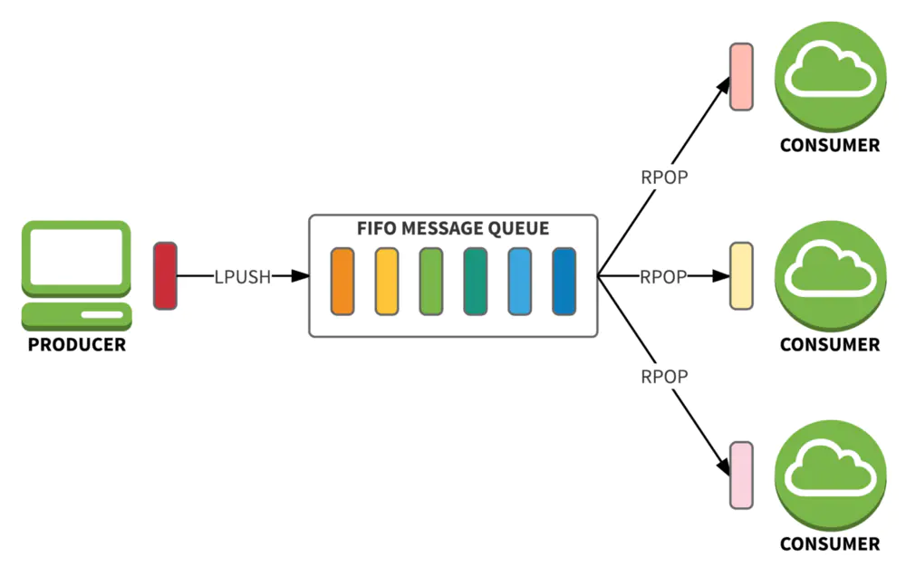
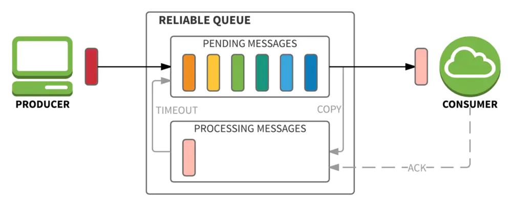
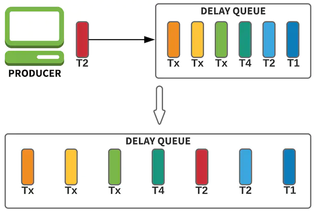

# 消息队列

我们目前写的爬虫，看似爬取效率还可以，实则还有很大的提升空间。比方说，一段爬虫程序是从第一个链接开始爬取，第一个链接爬取完了以后，获取第二个链接并开始爬取，循环往复，如果我们再启动一个相同的爬虫程序，它还是从相同的第一个链接开始爬取，相当于无效爬取。**试想一下，如果我们将所有要爬取的链接先获取下来，启动相同的爬虫程序，不重复的获取链接，那么爬取效率将成倍提升。这时，消息队列就排上用场了。**

### 消息队列简介

消息队列：**简称MQ，是一种应用间的通信方式，消息发送后可以立即返回，由消息系统来确保消息的可靠传递。**

**消息队列作用**：在高并发环境下，由于来不及同步处理，请求往往会发生堵塞，**通过使用消息队列，我们可以异步处理请求，从而缓解系统的压力**。

##### 模型组成

生产者(producer)：**发送消息的程序。**


队列(queue)：**存储消息的队列。** 一个队列只受到主机的内存和磁盘的限制，它实际上是个大的消息缓冲区。


消费者(consumer)：**等待接收消息的程序**。


##### 模型流程

生产者(producer)创建消息，然后发布到队列(queue)中，最后将消息发送到监听的消费者(consumer)。


?> 多个生产者可以发送消息到一个队列，多个消费者可以从队列中接收数据。

?> 生产者只管把消息发布到队列中不管谁来取，消费者只管从队列中取消息而不管是谁发布的。这样发布者和使用者都不用知道对方的存在。

!> 消息队列的特点是：**阅后即焚**。当消费者使用了消息队列里面的消息后，消息队列里面的消息就被销毁了。

### 消息队列模块

##### Queue队列

线程队列模块 `queue`：**用于多线程，它可以指定缓冲区大小的阻塞队列**。

```python
import queue

# 创建一个线程队列
q = queue.Queue()
```

!>  `queue` 模块生成的线程队列，在多进程模式下，数据无法在多个进程之间共享。

进程队列模块 `multiprocessing`：**用于多进程，它通过管道以及锁和信号量机制来协调多个进程。**

```python
import multiprocessing

# 创建一个进程队列
q = multiprocessing.Queue()
```

!>  `multiprocessing` 模块生成的进程队列，可以在多进程之间共享同一个变量的数据

##### 插入、获取、顺序

```python
import queue

# 创建线程队列，Queue先进先出模式
q1 = queue.Queue()

for i in range(3):
	# 向队列q中插入变量数据i
    q1.put(i)

# get()获取数据，每次get只能取一个数据
print(q1.get())		# 0
print(q1.get())		# 1
print(q1.get())		# 2


# 创建线程队列，LifoQueue先进先后模式
q2 = queue.LifoQueue()

for i in range(3):
	# 向队列q中插入变量数据i
    q2.put(i)

print(q2.get())		# 2
print(q2.get())		# 1
print(q2.get())		# 0
```

##### 长度、上限、阻塞

```python
import queue

q = queue.Queue()

# empty()判断队列是否为空
print(q.empty())	# True
# 获取队列q的长度
print(q.qsize())	# 0

for i in range(5):
    q.put(i)

# empty()判断队列是否为空
print(q.empty())	# False
# 获取队列q的长度
print(q.qsize())	# 5
```

**`maxsize` 参数：参数表示队列中能存放的数据个数的上限；默认等于0，表示队列大小没有限制。**

```python
import queue

# 创建一个长度为4的队列
q = queue.Queue(maxsize=4)

# 插入数据0，1，2，3后，消息队列数据达到上限，发生阻塞，不会执行下面的print语句。
for i in range(5):
    q.put(i)	
print('程序结束')
```

!> 数据量一旦达到上限，插入会导致阻塞，直到队列中的数据被消费掉。

```python
import queue

# 创建一个长度为4的队列
q = queue.Queue(maxsize=4)

for i in range(5):
    q.put(i)
    print(q.get())	
print('程序结束')	

'''
输出：
0 1 2 3 4
程序结束

解释：put(i)插入一次数据，get()获取一次数据，数据量不会达到队列上限4，能执行print语句。
'''
```

?> `queue` 和 `multiprocessing` 模块，两者 `Queue` 队列的 `get`、`put`、`empty`、`qsize` 等方法名称是相同的。

### Redis消息队列

Redis是时下比较火的**内存数据库**，以简单高效著称，具有丰富的数据类型，常用于缓存数据，也支持队列queue，我们可以将Redis作为message broker（消息中间人）。

Redis目前只能实现简单的消息队列功能，它所具有的优点：

- 极低延迟：得益于Redis本身的高效，消息可以极低延迟传递。
- 上手容易：只需组合使用两三个命令，即可完成消息传递。
- 查看便利：可以便利地查看队列内容；利用 `MONITOR` 命令甚至可以实时监控消息入队和出队。

如果应用场景只需要简单的消息传递，不妨尝试使用Redis。

##### 消息队列模式

Redis提供了两种方式来作消息队列。一个是使用生产者消费模式模式，另外一个是发布订阅者模式。

**生产者消费模式模式**：让一个或者多个客户端监听消息队列，一旦消息到达，消费者马上消费，谁先抢到算谁的，如果队列里没有消息，则消费者继续监听。

**发布订阅者模式**：也是一个或多个客户端订阅消息频道，只要发布者发布消息，所有订阅者都能收到消息，订阅者都是ping的。

##### FIFO队列

FIFO（先进先出）队列是队列的基本形式，也是最简单的消息队列。使用一个列表和`LPUSH`、`RPOP`两个命令即可实现一条FIFO队列。



生产者通过`LPUSH`将消息发送到Redis：

```
127.0.0.1:6379> LPUSH queue "message-1"
127.0.0.1:6379> LPUSH queue "message-2"
```

消费者使用`RPOP`从队列中依次获取消息：

```
127.0.0.1:6379> RPOP queue
"message-1"
127.0.0.1:6379> RPOP queue
"message-2"

# 当队列为空时，RPOP会直接返回空
127.0.0.1:6379> RPOP queue
(nil)
```

**注意：如果希望在队列为空时能够阻塞连接等待消息，直到队列接收到新的消息或超时，可以使用`BRPOP`。**

`RPOP`或`BRPOP`之后，消息就会从队列中删除。因此，当有多个消费者时，一条消息只能传递给其中一个消费者。我们不用担心在并发下同一条消息会传递给多个消费者，因为**Redis本身是一个单线程的程序，相当于所有操作都有一把天然的排他锁**。

##### 可靠队列

FIFO队列中的消息一经发送出去，便从队列里删除。如果由于网络原因消费者没有收到消息，或者消费者在处理这条消息的过程中崩溃了，就再也无法还原出这条消息。也就是说，**FIFO队列不能保证消息会传递成功**。

究其原因，在于**FIFO队列缺乏消息确认机制**，即消费者向队列报告消息已收到或已处理的机制。可靠队列便是加入了这一机制的消息队列。

利用Redis的 `RPOPLPUSH` 这一命令实现可靠队列，这个命令可以在从一个list中获取消息的同时把这条消息复制到另一个list里，并且这个过程是**原子性的**。

?> 原子性是指一个操作是不可中断的，要么全部执行成功要么全部执行失败，不存在部分成功或者部分失败。



利用`RPOPLPUSH`实现的可靠队列由两个列表组成，一个存储**待处理**（pending）的消息，另一个存储**处理中**（processing）的消息。

生产者通过`LPUSH`将消息发送到待处理列表：

```
127.0.0.1:6379> LPUSH queue:pending "message"
```

消费者使用`RPOPLPUSH`从待处理列表获取消息，同时将它加入处理中列表：

```
127.0.0.1:6379> RPOPLPUSH queue:pending queue:processing
"message"
```

此时这条消息已经从待处理列表中删除，并且复制到了处理中列表：

```
127.0.0.1:6379> LRANGE queue:pending 0 -1
(empty list or set)
127.0.0.1:6379> LRANGE queue:processing 0 -1
1) "message"
```

消费者在收到消息或者处理完消息后，使用`LREM`命令从处理中列表删除这条消息，即完成了**消息确认**：

```
127.0.0.1:6379> LREM queue:processing 1 "message"
```

使用`LREM`而不是`RPOP`的原因在于，在并发时，不能保证处理中的消息能按加入列表的先后顺序被确认，而`RPOP`会按顺序删除消息。

##### 延迟队列

延迟队列非常适用于对消费次序或时间没有强一致性需要的场景，主要特性是**进入队列的消息会被推迟到指定的时间才出队被消费**。因此，**延迟队列中的一条消息，除了消息本身外，还需要附加一个“何时出队”的信息**。



**Sorted Set是一个有序的集合，集合内元素的排序基于其加入集合时指定的score**。通过`ZRANGEBYSCORE`命令，我们可以取得score在指定区间内的元素。**将集合中的元素做为消息，score视为延迟的时间，这便是一个延迟队列的模型**。

生产者通过`ZADD`将消息发送到队列中：

```
127.0.0.1:6379> ZADD delay-queue 1520985600 "publish article"
```

消费者通过`ZRANGEBYSCORE`获取消息。如果时间未到，将得不到消息；当时间已到或已超时，都可以得到消息：

```
127.0.0.1:6379> ZRANGEBYSCORE delay-queue -inf 1520985599
(empty list or set)
127.0.0.1:6379> ZRANGEBYSCORE delay-queue -inf 1520985600 WITHSCORES
1) "publish article"
2) "1520985600"
127.0.0.1:6379> ZRANGEBYSCORE delay-queue -inf 1520985601 WITHSCORES
1) "publish article"
2) "1520985600"
```

使用`ZRANGEBYSCORE`取得消息后，消息并没有从集合中删出。需要调用`ZREM`删除消息：

```
127.0.0.1:6379> ZREM delay-queue "publish article"
```

美中不足的是，消费者组合使用`ZRANGEBYSCORE`和`ZREM`的过程不是原子的，当有多个消费者时会存在竞争，可能使得一条消息被消费多次。此时需要使用Lua脚本保证消费操作的原子性：

```
local message = redis.call('ZRANGEBYSCORE', KEYS[1], '-inf', ARGV[1], 'WITHSCORES', 'LIMIT', 0, 1);
if message > 0 then
  redis.call('ZREM', KEYS[1], message[1]);
  return message;
else
  return {};
end
```

### RabbitMQ框架

##### 简介

RabbitMQ是一个专门做队列的框架，在队列方面要比redies队列性能要好，支持的功能会更多，消息的可靠性更强。

##### 模型

RabbitMQ 是一个消息中间人（broker）: 它接收并且发送消息. 

可以想象一个邮局：当你把想要寄出的信放到邮筒里时，邮递员会把信件送到收信人那里。 

在这个比喻中, RabbitMQ 就是一个邮筒（接收）, 同时也是邮局（存储）和邮递员（转发） 。和邮局的主要不同点在于RabbitMQ不处理纸质信件, 而是 接收（accepts）, 存储（stores） 和转发（forwards）二进制数据块 —— 消息（messages）. 

