# 验证码

在爬取数据的过程中，难免会遇到各种各样的验证码来阻挡爬虫，绝大部分的验证码对于人来说还是很好识别并验证成功的。但爬虫不是人，只是一段死板的程序，没有人灵活思维和高效的识别，所以如何破解验证码是爬虫的一个难点，因为它涉及到的不仅仅是爬取数据还有图片识别、轨迹计算等其他方面的分析。

### 图形验证码

##### 安装识别库

当前大多数验证码还是图形验证码，针对这类验证码我们就可以使用 Python 的 OCR 识别库来识别。

**OCR 技术**：图形验证码转换成电子文本，然后将识别的结果提交给服务器，达到自动识别验证码的过程。

**tesserocr**：**即 OCR 识别库** ，但其实是对 tesseract 做的一 层 Python API 封装，所以它的核心是 tesseract。 **因此，在安装 tesserocr 之前，我们需要先安装 tesseract 。**

```python
# 先安装tesseract
pip install tesseract
# 后安装tesserocr
pip install tesserocr
```

!> 绝大多数情况下，tesserocr库都不能安装成功，就需要手动下载进行安装，下载地址：https://github.com/simonflueckiger/tesserocr-windows_build/releases

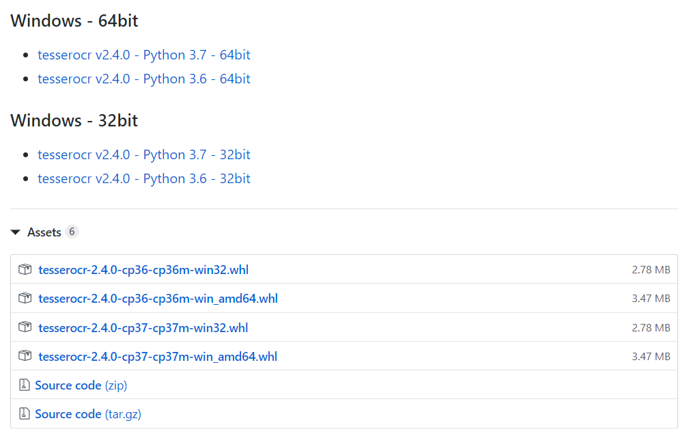

根据自己的系统和安装的Python环境版本选择合适的库进行安装：

```
tesserocr-2.4.0-cp36-cp36m-win32.whl
2.4.0：tesserocr的版本
cp36：适合Python3.6的环境
win32：适合windows32位操作系统

tesserocr-2.4.0-cp37-cp37m-win_amd64.whl
cp37：适合Python3.7的环境
win_amd64：适合windows64位操作系统
```

将库下载到本地，打开命令行进入到下载的tesserocr库位置，输入下面命令即可安装成功：

```
pip install tesserocr-2.4.0-cp37-cp37m-win_amd64.whl
```

##### 安装识别软件

识别图片不仅仅需要识别库，还需要安装识别软件[tesseract-ocr](https://digi.bib.uni-mannheim.de/tesseract/)才能成功识别。

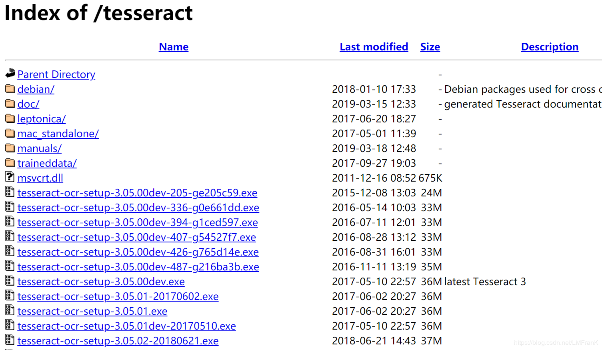

其中，文件名中带有dev的为开发版本，不带dev的为稳定版本，选择合适的版本进行安装。

安装过程中，其中可以勾选`Additional language data(download)`选项来安装OCR识别支持的语言包，识别多国语言。

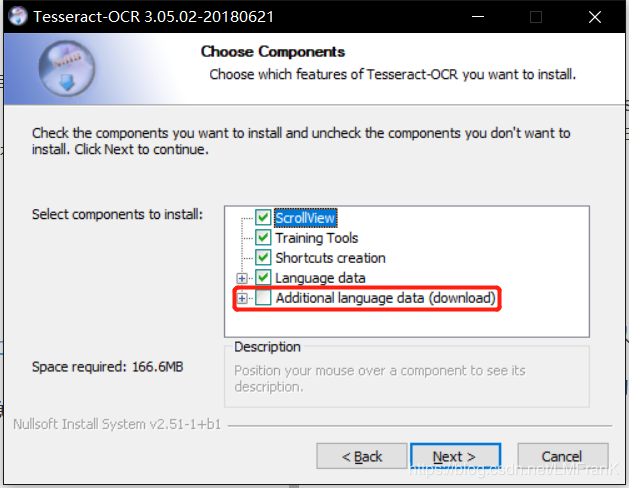

将软件的安装路径添加到“系统变量”中Path中保存。

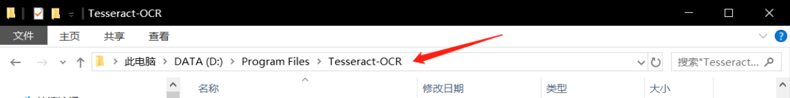

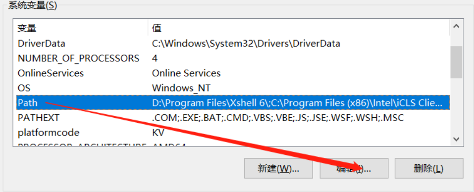

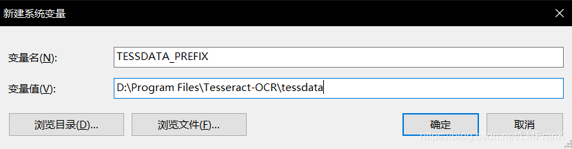

在后面使用过程中**可能会报这样的错误**：`RuntimeError: Failed to init API, possibly an invalid tessdata path:路径 `

**解决办法**：我们只需要将Tesseract_OCR安装路径下的tessdata的目录，拷贝到上面报错的`路径`中即可。

##### 无背景图片验证码

无背景验证码：指的是**内容背景是单色的，无其花纹的验证码**。

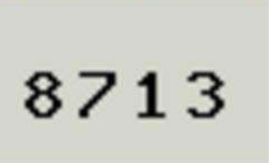

这类验证码相对简单，tesserocr的**识别率还比较高**的。

```python
# 导入tesserocr
import tesserocr
# 导入图像模块
from PIL import Image

# 方法一：以图片对象的形式来识别的验证码
# 读取image.jpg图片
image = Image.open('image.jpg')
# 识别图片
code1 = tesserocr.image_to_text(image)
# 输出识别结果
print(f'code1识别结果：{code1}')	

# 方法二：以图片文件的形式来识别的验证码（此方法中图片的名称不能有中文否则会报错）
code2 = tesserocr.file_to_text('image.jpg')
# 输出识别结果
print(f'code2识别结果：{code2}')

'''
输出：
code1识别结果：8713
code2识别结果：8713
'''
```

##### 有背景图片验证码

有背景验证码：指的是**背景颜色多样，有花纹的验证码**。


对于有嘈杂的背景的验证码，**直接识别的识别率会很低**，因此我们就要对图片进行一定的处理，来提高识别率。大体步骤有三点：

1. **灰度化：以黑色为基准色，用不同的饱和度的黑色来显示图像，灰度图像的每个像素点色值在0-255，0代表纯黑，255代表纯白**


2. **二值化：将小于阈值(129)的像素点统一设置为黑色(0)，反之统一设置为白色(255)，得到黑白图像。**


3. **去噪点：检测像素点周围邻近的8个像素点，如果有4个即以上的白色像素点，则认为当前像素点是噪点，设置为白色，反之，则不是噪点，设置为黑色。**

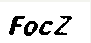

```python
import tesserocr
from PIL import Image

# 打开图片对象
image = Image.open('图片.jpg')
# 图片灰度化
image1 = image.convert("L")
# 显示图片
image1.show()

# 图片二值化，129是二值化的阈值
image2 = image1.point(lambda x: 255 if x > 129 else 0)
image2.show()

# 去噪函数
def denoising(image):
    pixdata = image.load()
    # 获取图片宽高
    w, h = image.size
    # 遍历像素点
    for j in range(1, h - 1):
        for i in range(1, w - 1):
            count = 0
            l = pixdata[i, j]
            if l == pixdata[i, j - 1]:
                count = count + 1
            if l == pixdata[i, j + 1]:
                count = count + 1
            if l == pixdata[i + 1, j - 1]:
                count = count + 1
            if l == pixdata[i + 1, j + 1]:
                count = count + 1
            if l == pixdata[i + 1, j]:
                count = count + 1
            if l == pixdata[i - 1, j + 1]:
                count = count + 1
            if l == pixdata[i - 1, j - 1]:
                count = count + 1
            if l == pixdata[i - 1, j]:
                count = count + 1
            if count < 4:
                pixdata[i, j] = 255
    return image
# 去噪点
image3 = denoising(image2)
image3.show()

# 识别处理后验证图片对象
res = tesserocr.image_to_text(image3)
print(res)

'''
输出：
FocZ
'''
```

我这里选择的是**中规中矩比较好识别的验证码，OCR才能成功识别**。但对于**字符有扭曲、变形的验证码，使用OCR去识别成功率就很低了**，这就**需要软件将验证码字符进行切割处理为像素块来识别**，类似于下图，这里就不介绍了。**总的来说，OCR的识别成功率并不高**。

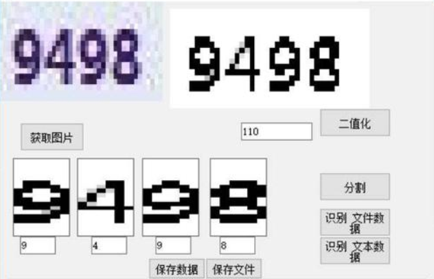

### 滑块验证码

##### 滑块验证码简介

普通图片验证码：即**方形缺口的图片验证码，将图片拖动至缺口位置即可验证成功**。

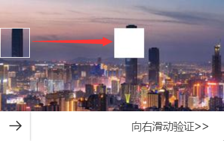

##### 网站验证分析

经过分析，当前网站的**验证方式就是核验滑块的移动距离**。**若移动距离等于滑块到缺口的距离，则验证成功，否则就验证失败。**


当验证成功以后，访问网站的URL就会带上滑块的位移距离。

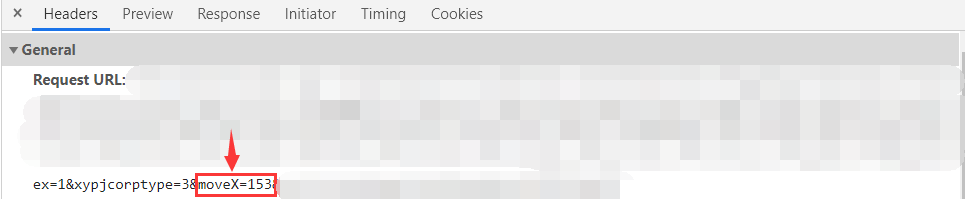

既然这样，我们就直接识别大背景图中白色缺口所在位置即可。因为是最终需要的是位移距离，因此问我们**只需要知道白色缺口的横坐标，即下图红线的长度**。


##### 像素点比对

```python
from PIL import Image

# 打开图片对象
image1 = Image.open('image.png')
# 白色像素点个数
count = 0
# 像素点遍历方式：从上往下，从左往右
# 遍历图片的X轴
for x in range(0, image1.size[0]):
    # 遍历图片的Y轴
    for y in range(0, image1.size[1]):
        # 获取当前坐标色素点的RGB值
        color = image1.load()[x, y]
        # 白色的RGB值(255,255,255)，但颜色识别会有误差，因此认为RGB值不小于(245,245,245)即为白色
        if color[0] >= 245 and color[1] >= 245 and color[2] >= 245:
            count +=1
        # 当连续出现25个白色像素点时，则认为找到白色方块缺口
        else:
            if count > 0:
                count -=1
        if count > 25:
            break
    if count > 25:
        break

# 输出X轴的横坐标
print(f'白色缺口横坐标：{x}')        # 白色缺口横坐标：153
```

### 缺口验证码

上面的验证码相对来说还比较好识别，只要你识别到了多个连续的白色像素点，就基本上找到了缺口的位置，但带缺口的验证码的就不是那么容易处理了。

##### 易盾验证码


### 极验验证码

##### 极验验证码简介

极验验证码：即**拼图缺口的图片验证码，将滑块的凹凸处拖动至缺口的凹凸处即可验证成功**。

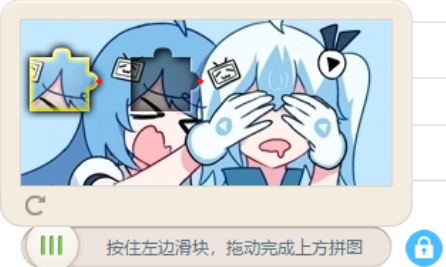

##### 验证码区别

极验验证码相比滑块验证码，在缺口上多了凹凸，不仅如此还添加其他情况，验证更加严格：

1. **验证失效**：当频繁滑动极验验证码时，会偶尔出现“怪物吃掉拼图”、“请重新验证”等验证失效的情况。
2. **时间限制**：极验验证码生成时，若没有及时验证，即使后面验证通过，也会要求重新再验证一次。
3. **轨迹验证**：在拖动滑块时，会记录并上传滑块的移动轨迹，服务器会分析判定是否为人类行为还是机器行为。

##### 破解极验思路

这里就只先讲解一下破解极验的思路，因为操作要用到Selenium自动化测试工具，因此具体的破解代码就放到[爬虫13-Selenium自动化测试工具](爬虫13-Selenium自动化测试工具.md)中再详细讲解。

1. **访问登录页面，确保必要的元素加载完成。**
2. 点击**按钮周围**节点，获取**不带缺口**的验证码。

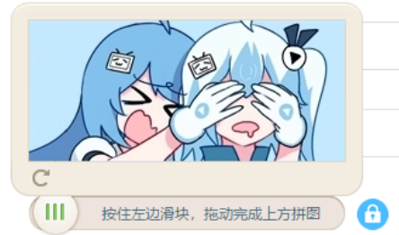

3. 再点击**按钮**节点，获取**带缺口**的验证码。


4. 先将原图和有滑块的图进行像素对比，找到如图所标的两点位置，可以从右向左找到右边点的位置。

   

5.假如每个小方块就是⼀个像素点，我们从最右边的像素点1开始对比像素点，再对比像素点2第⼀列对比完再对比第⼆列，直到找到点2的位置(grap2)；然后寻从中间(left_start)的像素点1开始对比，直至找到点1的位置(grap1)；然后计算出两点之间的距离，就知道滑块应该滑动距离。

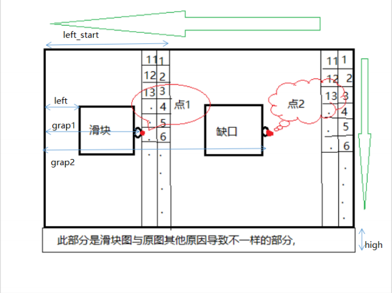

6.模拟人类滑动，所以我们在滑动的时候先分段加速，后分段减速的方式进行滑动。最后，破解极验验证码。