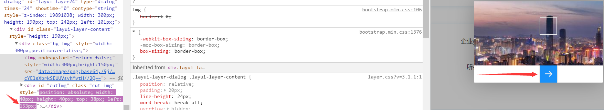
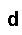

# 验证码

在爬取数据的过程中，难免会遇到各种各样的验证码来阻挡爬虫，绝大部分的验证码对于人来说还是很好识别并验证成功的。但爬虫不是人，只是一段死板的程序，没有人灵活思维和高效的识别，所以如何破解验证码是爬虫的一个难点，因为它涉及到的不仅仅是爬取数据还有图片识别、轨迹计算等其他方面的分析。

### 图形验证码

##### 安装识别软件

识别图片不仅仅需要识别库，还需要安装识别软件[tesseract-ocr](https://digi.bib.uni-mannheim.de/tesseract/)才能成功识别。


其中，文件名中带有dev的为开发版本，不带dev的为稳定版本，选择合适的版本进行安装。

安装过程中，其中可以勾选`Additional language data(download)`选项来安装OCR识别支持的语言包，识别多国语言。


将软件的安装路径添加到“系统变量”中Path中保存。


在后面使用过程中**可能会报这样的错误**：`RuntimeError: Failed to init API, possibly an invalid tessdata path:路径 `

**解决办法**：我们只需要将Tesseract_OCR安装路径下的tessdata的目录，拷贝到上面报错的`路径`中即可。


##### 安装识别库

当前大多数验证码还是图形验证码，针对这类验证码我们就可以使用 Python 的 OCR 识别库来识别。

**OCR (光学字符识别)**：指通过扫描字符，然后通过其形状将其翻译成电子文本的过程。

**pytesseract** ：是Google的Tesseract-OCR引擎包装器，但其实是对tesseract封装的一个Python库，可以用来识别图片中的字符。**所以，在使用pytesseract之前，我们需要安装tesseract。**

```python
# 先安装tesseract
pip install tesseract
# 后安装pytesseract
pip install pytesseract
```

!> pytesseract安装成功后，使用可能会报如下错误：`pytesseract.pytesseract.TesseractError: (1, ‘Error opening data file \Program Files (x86)\...`


解决方法：**设置环境变量 TESSDATA_PREFIX，它的值为Tesseract-OCR目录（安装识别软件会生成的目录）当中的tessdata目录。**设置完再次运行如果还报相同的错误，重启pycharm再运行，如果仍然报相同的错误，重启一下电脑在运行。


**tesserocr**：**即 OCR 识别库** ，但其实是对 tesseract 做的一层 Python API 封装，所以它的核心是 tesseract。 **因此，在安装 tesserocr 之前，我们需要先安装 tesseract 。**

```python
# 先安装tesseract
pip install tesseract
# 后安装tesserocr
pip install tesserocr
```

!> 绝大多数情况下，tesserocr库都不能安装成功，就需要手动下载进行安装，下载地址：https://github.com/simonflueckiger/tesserocr-windows_build/releases


根据自己的系统和安装的Python环境版本选择合适的库进行安装：

```
tesserocr-2.4.0-cp36-cp36m-win32.whl
2.4.0：tesserocr的版本
cp36：适合Python3.6的环境
win32：适合windows32位操作系统

tesserocr-2.4.0-cp37-cp37m-win_amd64.whl
2.4.0：tesserocr的版本
cp37：适合Python3.7的环境
win_amd64：适合windows64位操作系统
```

将库下载到本地，打开命令行进入到下载的tesserocr库位置，输入下面命令即可安装成功：

```
pip install tesserocr-2.4.0-cp37-cp37m-win_amd64.whl
```

##### 无背景图片验证码

无背景验证码：指的是**内容背景是单色的，无其花纹的验证码**。


这类验证码相对简单，tesserocr的**识别率还比较高**的。

```python
# 导入tesserocr
import tesserocr
# 导入图像模块
from PIL import Image

# 方法一：以图片对象的形式来识别的验证码
# 读取image.jpg图片
image = Image.open('image.jpg')
# 识别图片
code1 = tesserocr.image_to_text(image)
# 输出识别结果
print(f'code1识别结果：{code1}')	

# 方法二：以图片文件的形式来识别的验证码（此方法中图片的名称不能有中文否则会报错）
code2 = tesserocr.file_to_text('image.jpg')
# 输出识别结果
print(f'code2识别结果：{code2}')

'''
输出：
code1识别结果：8713
code2识别结果：8713
'''
```

同样的，使用pytesseract也能识别该验证码：

```python
# 导入pytesseract
import pytesseract
# 导入图像模块
from PIL import Image

# 读取image.jpg图片
image = Image.open('image.jpg')
# 识别图片
code1 = pytesseract.image_to_string(image)
# 输出识别结果
print(f'code1识别结果：{code1}')

'''
输出：
code1识别结果：8713
'''
```

##### 有背景图片验证码

有背景验证码：指的是**背景颜色多样，有花纹的验证码**。


对于有嘈杂的背景的验证码，**直接识别的识别率会很低**，因此我们就要对图片进行一定的处理，来提高识别率。大体步骤有三点：

1. **灰度化：以黑色为基准色，用不同的饱和度的黑色来显示图像，灰度图像的每个像素点色值在0-255，0代表纯黑，255代表纯白**


2. **二值化：将小于阈值(129)的像素点统一设置为黑色(0)，反之统一设置为白色(255)，得到黑白图像。**


3. **去噪点：检测像素点周围邻近的8个像素点，如果有4个即以上的白色像素点，则认为当前像素点是噪点，设置为白色，反之，则不是噪点，设置为黑色。**


```python
import tesserocr
import pytesseract
from PIL import Image

# 打开图片对象
image = Image.open('image.jpg')
# 图片灰度化
image1 = image.convert("L")
# 显示图片
image1.show()

# 图片二值化，129是二值化的阈值
image2 = image1.point(lambda x: 255 if x > 129 else 0)
image2.show()

# 去噪函数
def denoising(image):
    pixdata = image.load()
    # 获取图片宽高
    w, h = image.size
    # 遍历像素点
    for j in range(1, h - 1):
        for i in range(1, w - 1):
            count = 0
            l = pixdata[i, j]
            if l == pixdata[i, j - 1]:
                count = count + 1
            if l == pixdata[i, j + 1]:
                count = count + 1
            if l == pixdata[i + 1, j - 1]:
                count = count + 1
            if l == pixdata[i + 1, j + 1]:
                count = count + 1
            if l == pixdata[i + 1, j]:
                count = count + 1
            if l == pixdata[i - 1, j + 1]:
                count = count + 1
            if l == pixdata[i - 1, j - 1]:
                count = count + 1
            if l == pixdata[i - 1, j]:
                count = count + 1
            if count < 4:
                pixdata[i, j] = 255
    return image
# 去噪点
image3 = denoising(image2)
image3.show()

# 识别处理后验证图片对象
res1 = tesserocr.image_to_text(image3)
print(f'tesserocr识别结果：{res1}')

# 识别处理后验证图片对象
res2 = pytesseract.image_to_string(image3)
print(f'pytesseract识别结果：{res2}')

'''
输出：
tesserocr识别结果：FocZ
pytesseract识别结果：FocZ
'''
```

##### 单字符图片验证码

单字符图片验证码：**即图片中只有一个字符的验证码。**

虽然现在验证码图片中的字符至少都是4位起，但有些时候我们需要将验证码拆分逐一识别，这就需要识别单字符图片验证码了。各位，可能会想，相比于上面多字符验证码，单个字符应该更好处理吧，但过程恰恰相反。


```python
import tesserocr
import pytesseract
from PIL import Image

image = Image.open('image.png')

code1 = tesserocr.image_to_text(image)
print(f'tesserocr识别结果：{code1}')

code2 = pytesseract.image_to_string(image)
print(f'pytesseract识别结果：{code2}')

'''
输出：
tesserocr识别结果：
pytesseract识别结果：
'''
```

上面这张图就一个数字“1”，没有多余的颜色花纹和噪点，按理来说应该很好识别，但为什么tesserocr库和pytesseract库都没把它识别出来？**我猜测原因可能是，验证码图片中的字符至少都是4位起，而这些识别库会把只有1个或2个字符的识别结果当成错误识别，直接返回一个空结果。**如果需要单独识别某个字符，需要设置参数：**只针对pytesseract库**。

```python
import pytesseract
from PIL import Image

image = Image.open('image.png')

# 识别结果仅限数字0123456789
code1 = pytesseract.image_to_string(image, config='--psm 6 --oem 3 -c tessedit_char_whitelist=0123456789')
print(f'pytesseract识别结果：{code1}')

# 识别结果仅限大小写字母
code2 = pytesseract.image_to_string(image, config='--psm 6 --oem 3 -c tessedit_char_whitelist=ABCDEFGHIJKLMNOPQRSTUVWXYZabcdefghijklmnopqrstuvwxyz')
print(f'pytesseract识别结果：{code2}')

'''
输出：
pytesseract识别结果：1（识别正确）
pytesseract识别结果：l（识别错误，因为识别结果仅限大小写字母，而小写字母l与1最相近）
拓展：参数中还可以设置语言类型，lang='eng'，代表英语；lang='chi_sim'，代表简体中文。
'''
```

我这里选择的是**中规中矩比较好识别的验证码，OCR才能成功识别**。但对于**字符有扭曲、变形的验证码，使用OCR去识别成功率就很低了**，这就**需要软件将验证码字符进行切割处理为像素块来识别**，类似于下图，这里就不介绍了。**总的来说，OCR的识别成功率并不高**。


##### 

### 滑块验证码

##### 滑块验证码简介

普通图片验证码：即**方形缺口的图片验证码，将图片拖动至缺口位置即可验证成功**。


##### 网站验证分析

经过分析，当前网站的**验证方式就是核验滑块的移动距离**。**若移动距离等于滑块到缺口的距离，则验证成功，否则就验证失败。**



当验证成功以后，访问网站的URL就会带上滑块的位移距离。


既然这样，我们就直接识别大背景图中白色缺口所在位置即可。因为是最终需要的是位移距离，因此问我们**只需要知道白色缺口的横坐标，即下图红线的长度**。


##### 像素点比对

```python
from PIL import Image

# 打开图片对象
image1 = Image.open('image.png')
# 读取图像的RGB值
image1 = image1.convert('RGB')
# 白色像素点个数
count = 0
# 像素点遍历方式：从上往下，从左往右
# 遍历图片的X轴
for x in range(0, image1.size[0]):
    # 遍历图片的Y轴
    for y in range(0, image1.size[1]):
        # 获取当前坐标色素点的RGB值
        color = image1.load()[x, y]
        # 白色的RGB值(255,255,255)，但颜色识别会有误差，因此认为RGB值不小于(245,245,245)即为白色
        if color[0] >= 245 and color[1] >= 245 and color[2] >= 245:
            count +=1
        # 当连续出现25个白色像素点时，则认为找到白色方块缺口
        else:
            if count > 0:
                count -=1
        if count > 25:
            break
    if count > 25:
        break

# 输出X轴的横坐标
print(f'白色缺口横坐标：{x}')        # 白色缺口横坐标：153
```

### 缺口验证码

缺口验证码：**拼图存在缺口的图片验证码，将滑块的凹凸处拖动至缺口的凹凸处即可验证成功。**

滑块验证码相对来说还比较好识别，只要你识别到了多个连续的白色像素点，就基本上找到了缺口的位置，但带缺口的验证码的就不是那么容易处理了。**因为涉及到的图像处理会更复杂，而且破解这种缺口验证码的方法，拿去破解其他缺口验证码就可能不管用了。**

##### OpenCV视觉库

OpenCV是一个用C++语言编写基于BSD许可（开源）发行的跨平台计算机视觉库，拥有丰富的常用图像处理函数，能够快速的实现一些图像处理和识别的任务，同时可以运行在Linux、Windows、Android和Mac OS操作系统上，并提供了Python、Ruby、MATLAB等语言的接口，从而使得图像处理和图像分析变得更加易于上手，让开发人员更多的精力花在算法的设计上。

**whl文件安装法**：先去[官网](https://www.lfd.uci.edu/~gohlke/pythonlibs/#opencv)下载相应Python版本的OpenCV的whl文件，然后在whl文件所在目录下使用命令进行安装即可。


```
pip install opencv_python‑3.4.1‑cp36‑cp36m‑win_amd64.whl
```

**包命令安装法**：直接通过包命令进行安装。

```
pip install opencv-python
```

**导入方法**：注意安装库的名称为 `opencv-python`，导入模块的名称为 `cv2`.

```
import cv2
```

**基本库函数**：列举一些需要用的基本库函数。

```python
# cv2.imread()接口读图像，读进来直接是BGR格式，不是我们最常见的RGB格式，数据格式在0~255，颜色肯定有区别。
cv2.imread(filepath, flags)     #读入一张图像
    filepath：要读入图片的完整路径（可以是绝对路径或者相对路径，路径中不能出现中文）
    flags：图像的通道和色彩信息
    	# flag = -1, 8位深度，原通道
        # flag = 0， 8位深度，1通道（灰度图（单通道））
        # flag = 1， 8位深度，3通道（默认为1，即读取为彩色图像）
        # flag = 2， 原深度， 1通道
        # flag = 3， 原深度， 3通道
        # flag = 4， 8位深度，3通道 
    cv2.IMREAD_COLOR：默认参数，读入一副彩色图片，忽略alpha通道
    cv2.IMREAD_GRAYSCALE：读入灰度图片
    cv2.IMREAD_UNCHANGED：顾名思义，读入完整图片，包括alpha通道

cv2.imshow(wname, img)     #显示图像
    wname：显示图像的窗口的名字
    img：显示的图像（imread读入的图像），窗口大小自动调整为图片大小
# 在运行cv2.imshow后，需要使用cv2.waitKey来保持窗口的显示，否则图像会一闪而过
cv2.waitKey(delay)
	delay参数表示延迟多少毫秒。默认情况为0。当delay≤0，可以理解为延迟无穷大毫秒，就是暂停了。

cv2.imwrite(file, img, num)    #保存一张图像
	file：要保存的文件名
	img：要保存的图像。可选的第三个参数，它针对特定的格式：对于JPEG，其表示的是图像的质量，用0 - 100的整数表示，默认95。
	num：压缩级别。默认为3。

cv2.resize(image, image2, dsize)     #图像缩放：(输入原始图像，输出新图像，图像的大小)
cv2.flip(img,flipcode)              #图像翻转：flipcode控制翻转效果。
	flipcode：等于0沿x轴翻转；大于0沿y轴翻转；小于0x,y轴同时翻转
```

图像格式有许多种，例如：BGR格式、RGB格式、GRAY格式、HSV格式。

```python
cv2.imread()：读出来是像素格式，即BGR格式
Image.open()：打开来的图像格式，即RGB格式

# 不同格式之间可以相互转换
cv2.cvtColor(img,XXXXXX)      #图像颜色空间转换
	img：即cv2.imread()读入的图像
cv2.cvtColor(img,cv2.COLOR_BGR2RGB)   #格式转换：将BGR格式转换成RGB格式
cv2.cvtColor(img,cv2.COLOR_RGB2GRAY)  #热力化：将RGB格式转换成GRAY格式，彩色图像转为热力图像
cv2.cvtColor(img,cv2.COLOR_GRAY2RGB)  #彩色化：将GRAY格式转换成RGB格式，灰度图像转为彩色图像
cv2.cvtColor(img, cv2.COLOR_RGB2HSV)  # 模型化：将RGB格式转换为HSV颜色模型
...
```


**模板匹配**：模板就是一副已知的小图像，而模板匹配就是在一副大图像中搜寻目标，已知该图中有要找的目标，且该目标同模板有相同的尺寸、方向和图像元素，通过一定的算法可以在图中找到目标。

```
模板匹配方法：
cv2.TM_CCOEFF （系数匹配法）：1表示完美的匹配；-1表示最差的匹配。
cv2.TM_CCOEFF_NORMED（归一化系数匹配法）
cv2.TM_CCORR （相关匹配法）：该方法采用乘法操作；数值越大表明匹配程度越好。
cv2.TM_CCORR_NORMED （归一化相关匹配法）
cv2.TM_SQDIFF （平方差匹配法）：采用平方差来进行匹配；最好的匹配值为0；匹配越差，匹配值越大。
cv2.TM_SQDIFF_NORMED （归一化平方差匹配法）
```

##### 易盾验证码

易盾验证码：网易易盾推出的一款嵌入式验证码，仅需轻轻滑动完成拼图，即可完成安全验证。


```python
import cv2
import numpy as np
from PIL import Image, ImageDraw

# 分析出具体位置
def tell_location(path1, path2, path3):
    # 以彩色图像BGR格式读取背景图
    img_rgb = cv2.imread(path2)
    # 将背景图转为热力图
    img_gray = cv2.cvtColor(img_rgb, cv2.COLOR_BGR2GRAY)
    # 以灰度图像BGR格式读取缺口图
    template = cv2.imread(path1, 0)
    # 使用归一化系数匹配法，在背景图中匹配缺口图
    res = cv2.matchTemplate(img_gray, template, cv2.TM_CCOEFF_NORMED)
    # 使用二分法查找阈值的精确值
    L = 0
    R = 1
    start = 0
    run = 1
    while run < 20:
        run += 1
        threshold = (R + L) / 2
        if threshold < 0:
            print('Error')
            return None
        # 输出满足条件的坐标
        loc = np.where(res >= threshold)
        if len(loc[1]) > 1:
            L += (R - L) / 2
        # 筛选出匹配度最高的
        elif len(loc[1]) == 1:
            start = loc[1][0]
            print('目标区域起点x坐标为：%d' % start)
            break
        elif len(loc[1]) < 1:
            R -= (R - L) / 2
    distance = int(start)
    draw_line(distance, path2, path3)
    # 通过跟踪发现，最终的轨迹落点x轴位置会大10px
    return distance + 10

 # 绘制一条竖线标记位置，方便查看效果
def draw_line(x, path2, path3):
    img = Image.open(path2)
    img_draw = ImageDraw.Draw(img)
    img_draw.line((x, 0, x, img.size[1]), 'red')
    img.save(path3)

if __name__ == '__main__':
    # 小缺口图
    path1 = './yidun1.jpg'
    # 大背景图
    path2 = './yidun2.jpg'
    # 处理后图
    path3 = './yidun3.jpg'
    # 调用方法
    tell_location(path1, path2, path3)
'''
输出：
目标区域起点x坐标为：215
'''
```

##### 拼图验证码

接下来，换一种拼图验证码，直接使用上面的方法可能就不管用了，识别结果就会出现偏差，红线并没有到缺口位置：


**这时先不忙寻找新的方法，既然是识别结果出现了偏差，那我们是否可以将图片中影响识别的点给抹除掉，将需要识别的点给凸显出来。看下验证码，缺口图和背景图的缺口位置都存在着明显的白色轮廓，根据这些白色像素点结合上面的二值化处理方法，我们就可以将整个轮廓凸显出来，再使用上面的方法就可以达到很好的识别效果。**


```python
import cv2
import numpy as np
from PIL import Image, ImageDraw

# 二值化方法
def binary(path1, path2):
    image1 = Image.open(path1)
    img_draw = ImageDraw.Draw(image1)
    for y in range(0, image1.size[1]):
        for x in range(0, image1.size[0]):
            all = image1.load()[x, y][0] + image1.load()[x, y][1] + image1.load()[x, y][2]
            # 设定阈值为220，大于220画为白色点，小于220画为黑色点
            if all // 3 > 220:
                img_draw.point((x, y), (255, 255, 255))
            else:
                img_draw.point((x, y), (0, 0, 0))
    image1.save(path2)

# 分析出具体位置
def tell_location(path1, path2, path3):
    # 以彩色图像BGR格式读取背景图
    img_rgb = cv2.imread(path2)
    # 将背景图转为热力图
    img_gray = cv2.cvtColor(img_rgb, cv2.COLOR_BGR2GRAY)
    # 以灰度图像BGR格式读取缺口图
    template = cv2.imread(path1, 0)
    # 使用归一化系数匹配法，在背景图中匹配缺口图
    res = cv2.matchTemplate(img_gray, template, cv2.TM_CCOEFF_NORMED)
    # 使用二分法查找阈值的精确值
    L = 0
    R = 1
    start = 0
    run = 1
    while run < 20:
        run += 1
        threshold = (R + L) / 2
        if threshold < 0:
            print('Error')
            return None
        # 输出满足条件的坐标
        loc = np.where(res >= threshold)
        if len(loc[1]) > 1:
            L += (R - L) / 2
        # 筛选出匹配度最高的
        elif len(loc[1]) == 1:
            start = loc[1][0]
            print('目标区域起点x坐标为：%d' % start)
            break
        elif len(loc[1]) < 1:
            R -= (R - L) / 2
    distance = int(start)
    draw_line(distance, path2, path3)
    # 返回识别距离
    return distance

 # 绘制一条竖线标记位置，方便查看效果
def draw_line(x, path2, path3):
    img = Image.open(path2)
    img_draw = ImageDraw.Draw(img)
    img_draw.line((x, 0, x, img.size[1]), 'red')
    img.save(path3)

if __name__ == '__main__':
    # 原小缺口图
    original1 = './image1.jpg'
    # 原大背景图
    original2 = './image2.jpg'
    # 处理后小缺口图
    path1 = './image4.png'
    # 处理后大背景图
    path2 = './image5.png'
    # 处理后图
    path3 = './image6.png'
    # 二值化处理原图
    binary(original1, path1)
    binary(original2, path2)
    # 调用方法识别处理后的图
    tell_location(path1, path2, path3)
'''
输出：
目标区域起点x坐标为：83
'''
```

除了结合使用前面的方法来识别图片，自己也可以写一种方法来识别图片，比如通过轮廓定位：


```python
from PIL import Image, ImageDraw

# 得出识别距离
def dis(path1, path2):
    '''
    :param path1: 缺口图
    :param path2: 背景图
    :return: 识别距离
    '''
    # 缺口图
    # 缺口图白色像素点列表
    white = []
    image1 = Image.open(path1)
    for y in range(0, image1.size[1]):
        # 缺口图的最大宽度为60
        x_min = 60
        x_max = 0
        for x in range(0, image1.size[0]):
            all = image1.load()[x, y][0] + image1.load()[x, y][1] + image1.load()[x, y][2]
            if all // 3 > 235:
                if x < x_min:
                    x_min = x
                if x > x_max:
                    x_max = x
        # 将每行最左边和最右边的白色点存储到列表
        if x_min != 60 and x_max != 0:
            white.append([x_min, y])
            white.append([x_max, y])
    # 筛选所有白点横坐标
    white_x = [item[0] for item in white]
    # 从左至右，从上至下，第一个白点x坐标减最小x坐标的距离
    white_fir = white_x[0] - min(white_x)
    # 背景图
    # 背景图的白色点列表
    white_bg = []
    image2 = Image.open(path2)
    for y in range(0, image2.size[1]):
        for x in range(0, image2.size[0]):
            all = image2.load()[x, y][0] + image2.load()[x, y][1] + image2.load()[x, y][2]
            if all // 3 > 235:
                # 将所有识别的白点存储到列表
                white_bg.append([x, y])
    # 遍历背景图白点列表
    for bg in white_bg:
        # 设置容错点数为7（点数越高，准确率越低，反之则越高，若为0，可能匹配不到，这和识别的白点有关）
        points = 7
        # 从第二个点遍历缺口图白点列表
        for i in range(1, len(white)):
            # 缺口图第一白点和后面所有白点的x轴差值,y轴差值
            fir_dif = [white[i][0] - white[0][0], white[i][1] - white[0][1]]
            # 结合背景图出现的白点，结合差值计算理论上可能出现的白点
            theory = [bg[0] + fir_dif[0], bg[1] + fir_dif[1]]
            # 理论白点不出现在背景图的实际白点中，容错点减一
            if theory not in white_bg:
                points -= 1
            # 当容错点为0或负数，则该点不是识别轮廓上的点
            if not points:
                break
            # 能运行到遍历结束，说明该点对应轮廓上的第一个白点
            if i == len(white) - 1:
                # 第一个白点横坐标减去轮廓第一个白点x坐标减最小x坐标的距离就是位移距离
                distance = bg[0] - white_fir
                print(f'识别位移距离：{distance}')
                return distance

# 绘制一条竖线标记位置，方便查看效果
def draw_line(x, path2, path3):
    img = Image.open(path2)
    img_draw = ImageDraw.Draw(img)
    img_draw.line((x, 0, x, img.size[1]), 'red')
    img.save(path3)

if __name__ == '__main__':
    # 原小缺口图
    original1 = './image1.jpg'
    # 原大背景图
    original2 = './image2.jpg'
    # 处理后图
    original3 = './image3.jpg'
    # 得出距离
    x = dis(original1, original2)
    if x:
        draw_line(x, original2, original3)
    else:
        print('未能有效识别...')
'''
输出：
识别位移距离：185
'''
```

##### 极验验证码

极验验证码：**一种用于区分自然人和机器人的验证服务。**

极验验证码相比缺口验证码的验证流程，还添加其他情况，验证更加严格：

1. **验证失效**：当频繁滑动极验验证码时，会偶尔出现“怪物吃掉拼图”、“请重新验证”等验证失效的情况。
2. **时间限制**：极验验证码生成时，若没有及时验证，即使后面验证通过，也会要求重新再验证一次。
3. **轨迹验证**：在拖动滑块时，会记录并上传滑块的移动轨迹，服务器会分析判定是否为人类行为还是机器行为。


**破解极验思路**：这里就只先讲解一下破解极验的思路，因为操作要用到Selenium自动化测试工具，因此具体的破解代码就放到[爬虫15-Selenium自动化测试工具](爬虫15-Selenium自动化测试工具.md)中再详细讲解。

1. **访问登录页面，确保必要的元素加载完成。**
2. 点击**按钮周围**节点，获取**不带缺口**的验证码。


3. 再点击**按钮**节点，获取**带缺口**的验证码。


4. 先将原图和有滑块的图进行像素对比，找到如图所标的两点位置，可以从右向左找到右边点的位置。

   

5.假如每个小方块就是⼀个像素点，我们从最右边的像素点1开始对比像素点，再对比像素点2第⼀列对比完再对比第⼆列，直到找到点2的位置(grap2)；然后寻从中间(left_start)的像素点1开始对比，直至找到点1的位置(grap1)；然后计算出两点之间的距离，就知道滑块应该滑动距离。


6.模拟人类滑动，所以我们在滑动的时候先分段加速，后分段减速的方式进行滑动。最后，破解极验验证码。

### GIF动态验证码

除了上面的三种验证码，验证码的种类还有很多，比方说GIF动态验证码，这类验证码的处理方法和上面的图形验证码处理方法类似，只不过多了一些处理步骤，相对来说复杂点。

##### 帧的概念

处理GIF动态验证码之前，首先得说一个常识性的东西，就是帧。**我们之所以能看到视频中流畅的运动画面，因为将每一张静止的图像快速连续地显示，当展示的速率超过了人眼的能分辨的速率，就给大脑造成在观看运动画面的假象。**

帧(Frame)：**视频或者动画中的每一张画面。**

帧数(Frames)：**为帧生成数量的简称，可以解释为静止画面的数量。如果一个动画的帧率恒定为 60 帧每秒(fps)，那么它在一秒钟内的帧数为 60 帧，两秒钟内的帧数为 120 帧。**

帧率(Frame rate)：**帧数(Frames)/时间(Time)，单位为帧每秒(f/s, frames per second, fps)。一般来说 FPS 用于描述视频、电子绘图或游戏每秒播放多少幀。**

总的来说，每秒钟帧数愈多，所显示的动作就会愈流畅。通常，要避免动作不流畅的最低帧率是 30 。

##### 处理流程

同样的，GIF动态验证码也是由一帧一帧的静态验证码快速展示所形成的。


首先要做的是，获取GIF动态验证码的帧数，然后将每一帧的静态验证码图像保存下来。


观察上面的静态验证码，可以看出该验证码阴险的两点：

1. **动态验证码中能看到有5个字符不停的出现，但在每一张静态验证码中就只显示4个字符，要想完整的识别字符就必须识别至少两张静态验证码**。
2. **多张静态验证码中就算是相同的字符，它的字体大小和粗细都不相同，这意味着多张静态验证码中即使是相同字符，识别出来的结果可能也会有所偏差。因此，我们需要从多张静态验证码中选出针对每个字符最好识别的大小和字体的图像。**

按照观察的结论，接下来就是将每张静态验证码**按照固定的字符宽度切割**为单个图片。


相对来说，字符的字体越大越粗，对于识别来说是越有利的，反应到图片上来说就是，**每列的单个图片的黑色像素点越多，就越符合我们识别的要求。**我们将每列图片上黑色像素点最多的图片筛选出来，再抹除掉背景花纹，就可以得到每个字符最容易识别的状态。



最后对每个字符进行单独识别，再将字符进行拼接，就可以得到该动态验证码的正确识别结果了。

##### 代码及注释

```python
# -*- coding: UTF-8 -*-
import os
import re
import pytesseract
from PIL import Image

# 分析图片
def analyseImage(path):
    im = Image.open(path)
    results = {
        'size': im.size,
        'mode': 'full',
    }
    try:
        while True:
            if im.tile:
                tile = im.tile[0]
                update_region = tile[1]
                update_region_dimensions = update_region[2:]
                if update_region_dimensions != im.size:
                    results['mode'] = 'partial'
                    break
            # im.tell()：返回当前帧所处位置，从0开始计算。
            # im.seek(frame)：在文件序列中查找指定的帧（默认为0帧）。如果查找超越了序列的末尾，则产生一个EOFError异常。
            im.seek(im.tell()+1)
    except EOFError:
        pass
    return results

# 处理图片并保存每一帧图片
def processImage(path):
    mode = analyseImage(path)['mode']
    im = Image.open(path)
    i = 0
    # 以列表形式返回图像调色板
    p = im.getpalette()
    # 图像转换为RGBA格式
    last_frame = im.convert('RGBA')
    try:
        while True:
            if not im.getpalette():
                im.putpalette(p)
            new_frame = Image.new('RGBA', im.size)
            if mode == 'partial':
                new_frame.paste(last_frame)
            new_frame.paste(im, (0, 0), im.convert('RGBA'))
            new_frame.save('./image/%s-%d.png' % ('yzm', i))
            i += 1
            last_frame = new_frame
            im.seek(im.tell() + 1)
    except EOFError:
        pass

# 切割静态验证码
def division():
    for index in range(5):
        for i in range(5):
            im = Image.open(f'./image/yzm-{index}.png')
            # 经过测算，每个字符长度大概为22
            im = im.crop((i*22, 0, (i+1)*22, 35))
            im.save(f'./image/{index}-{i}.png')

# 筛选最容易识别的字符图片
def distinguish():
    file_list = [file for file in os.listdir('./image') if 'yzm' not in file and '-' in file]
    count_list = [10000, 10000, 10000, 10000, 10000]
    for file in file_list:
        index = int(re.search(r'-(\d+)', file).group(1))
        count = 0
        image1 = Image.open(f'./image/{file}')
        for y in range(0, image1.size[1]):
            for x in range(0, image1.size[0]):
                all = image1.load()[x, y][0] + image1.load()[x, y][1] + image1.load()[x, y][2]
                if all // 3 > 30:
                    image1.load()[x, y] = (255, 255, 255)
                    count += 1
        if count_list[index] > count:
            count_list[index] = count
            image1.save(f'./image/{index}.png')

# 识别筛选处理后的图片字符并输出拼接结果
def know():
    file_list = [file for file in os.listdir('./image') if '-' not in file]
    letter = ''
    for file in file_list:
        im = Image.open(f'./image/{file}')
        # 使用pytesseract识别单个字符图片
        res = pytesseract.image_to_string(im, lang='eng', config='--psm 6 --oem 3 -c tessedit_char_whitelist=ABCDEFGHIJKLMNOPQRSTUVWXYZabcdefghijklmnopqrstuvwxyz')
        letter += res[0]
    print(letter)


if __name__ == "__main__":
    # 需要再当前目录下新建image文件夹，yzm-all.gif为动态验证码
    processImage('./image/yzm-all.gif')
    division()
    distinguish()
    know()
'''
识别结果：MQtdp
'''
```

### 低像素验证码

上面验证码都是图片质量比较好的验证码，即使将验证码图片放大以后，验证码字符依然很清晰。**但是有的验证码图片质量就不是那么高了，例如下面的验证码，无论是放大或者缩小图片都比较模糊，对于人眼识别都是有一定偏差的，对机器识别来说就更是有难度了。**


##### 筛选单字符图片

遇到这种类型的图片验证码时，首先我们要做的是，下载一定数量的验证码：


每个图片都包含5个字符，我们现在不奢求一次性全部识别，我们先识别图片中的一个字符，**这就要将验证码切割为单个字符的图片，然后在相同字符图片情况下，手动筛选出背景杂点、花纹最少，最好识别的单字符验证码**：


```python
import os
from PIL import Image

id = 0
for file in os.listdir('./yzm'):
    image = Image.open(f'./yzm/{file}')
    # 将图片的第一个字符切割出来
    im = image.crop((0, 0, 17, 22))
    im.save(f'./yzm/{id}.png')
    id += 1
```

##### 特征点提取

每个字符的形状是不一样的，电脑通过识别这些筛选出来，且相对标准的单个字符验证码其结果也肯定是不一样的。

```python
from PIL import Image

char = []
image1 = Image.open('./yzm/0.png')
for y in range(0, image1.size[1]):
    # 略掉图片左边宽度为4个像素点的空白部分
    for x in range(4, image1.size[0]):
        # 字符高度在6到17之间
        if y > 5 and y < 18:
            color = image1.load()[x, y]
            if color < 240:
                print('8', end='')
                # 收集特征点坐标，因为略掉图片左边空白部分，因此横坐标需要减4
                char.append([x-4, y])
            else:
                print(' ', end='')
    print()
# 手动去除杂点、补齐缺点
char.remove([8, 7])
char.remove([12, 7])
char.remove([12, 8])
char.remove([12, 9])
char.remove([10, 11])
char.remove([6, 12])
char.remove([0, 13])
char.remove([7, 13])
char.remove([12, 15])
char.remove([12, 17])
char.append([7, 9])
print(f'特征点:{char}')

'''
输出：
     8888888 
    888 88888
   8888  8888
   8888 88888
   8888  888 
    8888888  
   888888888 
8 888  88888 
 8888   8888 
 8888   88888
  8888  888  
   888888   8
特征点:[[5, 6], [6, 6], [7, 6], [8, 6], [9, 6], [10, 6], [11, 6], [4, 7], [5, 7], [6, 7], [9, 7], [10, 7], [11, 7], [3, 8], [4, 8], [5, 8], [6, 8], [9, 8], [10, 8], [11, 8], [3, 9], [4, 9], [5, 9], [6, 9], [8, 9], [9, 9], [10, 9], [11, 9], [3, 10], [4, 10], [5, 10], [6, 10], [9, 10], [10, 10], [11, 10], [4, 11], [5, 11], [6, 11], [7, 11], [8, 11], [9, 11], [3, 12], [4, 12], [5, 12], [7, 12], [8, 12], [9, 12], [10, 12], [11, 12], [2, 13], [3, 13], [4, 13], [8, 13], [9, 13], [10, 13], [11, 13], [1, 14], [2, 14], [3, 14], [4, 14], [8, 14], [9, 14], [10, 14], [11, 14], [1, 15], [2, 15], [3, 15], [4, 15], [8, 15], [9, 15], [10, 15], [11, 15], [2, 16], [3, 16], [4, 16], [5, 16], [8, 16], [9, 16], [10, 16], [3, 17], [4, 17], [5, 17], [6, 17], [7, 17], [8, 17], [7, 9]]
'''
```

##### 识别验证码

通过对可能出现的每个字符的特征点提取，我们就可以通过这些特征点来识别单个字符的验证码，最后将字符组合起来就得到完整的验证码结果了。


```python
import os
from PIL import Image

# 字符特征点
num_2 = [[4, 6], [5, 6], [6, 6], [7, 6], [8, 6], [9, 6], [10, 6], [3, 7], [4, 7], [5, 7], [8, 7], [9, 7], [10, 7], [11, 7], [3, 8], [4, 8], [8, 8], [9, 8], [10, 8], [11, 8], [8, 9], [9, 9], [10, 9], [11, 9], [8, 10], [9, 10], [10, 10], [11, 10], [7, 11], [8, 11], [9, 11], [10, 11], [11, 11], [6, 12], [7, 12], [8, 12], [9, 12], [10, 12], [5, 13], [6, 13], [7, 13], [8, 13], [9, 13], [10, 13], [4, 14], [5, 14], [6, 14], [7, 14], [8, 14], [9, 14], [3, 15], [4, 15], [5, 15], [6, 15], [7, 15], [8, 15], [2, 16], [3, 16], [4, 16], [5, 16], [6, 16], [1, 17], [2, 17], [3, 17], [4, 17], [5, 17], [6, 17], [7, 17], [8, 17], [9, 17], [10, 17], [11, 17], '2']
num_4 = [[8, 6], [9, 6], [10, 6], [11, 6], [7, 7], [8, 7], [9, 7], [10, 7], [11, 7], [6, 8], [7, 8], [8, 8], [9, 8], [10, 8], [11, 8], [5, 9], [6, 9], [7, 9], [8, 9], [9, 9], [10, 9], [11, 9], [5, 10], [6, 10], [7, 10], [8, 10], [9, 10], [10, 10], [11, 10], [4, 11], [5, 11], [6, 11], [8, 11], [9, 11], [10, 11], [3, 12], [4, 12], [5, 12], [7, 12], [8, 12], [9, 12], [10, 12], [2, 13], [3, 13], [4, 13], [7, 13], [8, 13], [9, 13], [10, 13], [1, 14], [2, 14], [3, 14], [4, 14], [5, 14], [6, 14], [7, 14], [8, 14], [9, 14], [10, 14], [11, 14], [1, 15], [7, 15], [8, 15], [9, 15], [10, 15], [6, 16], [7, 16], [8, 16], [9, 16], [6, 17], [7, 17], [8, 17], [9, 17], '4']
num_6 = [[6, 6], [7, 6], [8, 6], [9, 6], [10, 6], [11, 6], [5, 7], [6, 7], [7, 7], [4, 8], [5, 8], [6, 8], [3, 9], [4, 9], [5, 9], [6, 9], [2, 10], [3, 10], [4, 10], [5, 10], [6, 10], [7, 10], [8, 10], [9, 10], [10, 10], [2, 11], [3, 11], [4, 11], [5, 11], [6, 11], [8, 11], [9, 11], [10, 11], [11, 11], [2, 12], [3, 12], [4, 12], [5, 12], [8, 12], [9, 12], [10, 12], [11, 12], [2, 13], [3, 13], [4, 13], [5, 13], [7, 13], [8, 13], [9, 13], [10, 13], [11, 13], [2, 14], [3, 14], [4, 14], [5, 14], [8, 14], [9, 14], [10, 14], [11, 14], [2, 15], [3, 15], [4, 15], [5, 15], [8, 15], [9, 15], [10, 15], [11, 15], [3, 16], [4, 16], [5, 16], [7, 16], [8, 16], [9, 16], [10, 16], [4, 17], [5, 17], [6, 17], [7, 17], [8, 17], '6']
num_8 = [[5, 6], [6, 6], [7, 6], [8, 6], [9, 6], [10, 6], [11, 6], [4, 7], [5, 7], [6, 7], [9, 7], [10, 7], [11, 7], [3, 8], [4, 8], [5, 8], [6, 8], [9, 8], [10, 8], [11, 8], [3, 9], [4, 9], [5, 9], [6, 9], [7, 9], [8, 9], [9, 9], [10, 9], [11, 9], [3, 10], [4, 10], [5, 10], [6, 10], [9, 10], [10, 10], [11, 10], [4, 11], [5, 11], [6, 11], [7, 11], [8, 11], [9, 11], [3, 12], [4, 12], [5, 12], [7, 12], [8, 12], [9, 12], [10, 12], [11, 12], [2, 13], [3, 13], [4, 13], [8, 13], [9, 13], [10, 13], [11, 13], [1, 14], [2, 14], [3, 14], [4, 14], [8, 14], [9, 14], [10, 14], [11, 14], [1, 15], [2, 15], [3, 15], [4, 15], [8, 15], [9, 15], [10, 15], [11, 15], [2, 16], [3, 16], [4, 16], [5, 16], [8, 16], [9, 16], [10, 16], [3, 17], [4, 17], [5, 17], [6, 17], [7, 17], [8, 17], '8']
B = [[4, 6], [5, 6], [6, 6], [7, 6], [8, 6], [9, 6], [10, 6], [11, 6], [4, 7], [5, 7], [6, 7], [9, 7], [10, 7], [11, 7], [12, 7], [3, 8], [4, 8], [5, 8], [6, 8], [9, 8], [10, 8], [11, 8], [12, 8], [3, 9], [4, 9], [5, 9], [6, 9], [7, 9], [8, 9], [9, 9], [10, 9], [11, 9], [12, 9], [3, 10], [4, 10], [5, 10], [6, 10], [9, 10], [10, 10], [11, 10], [12, 10], [3, 11], [4, 11], [5, 11], [6, 11], [7, 11], [8, 11], [9, 11], [10, 11], [12, 11], [3, 12], [4, 12], [5, 12], [9, 12], [10, 12], [11, 12], [12, 12], [2, 13], [3, 13], [4, 13], [5, 13], [9, 13], [10, 13], [11, 13], [12, 13], [2, 14], [3, 14], [4, 14], [5, 14], [9, 14], [10, 14], [11, 14], [12, 14], [2, 15], [3, 15], [4, 15], [5, 15], [9, 15], [10, 15], [11, 15], [12, 15], [2, 16], [3, 16], [4, 16], [5, 16], [7, 16], [8, 16], [9, 16], [10, 16], [11, 16], [2, 17], [3, 17], [4, 17], [5, 17], [6, 17], [7, 17], [8, 17], [9, 17], 'B']
D = [[4, 6], [5, 6], [6, 6], [7, 6], [8, 6], [9, 6], [10, 6], [11, 6], [4, 7], [5, 7], [6, 7], [7, 7], [9, 7], [10, 7], [11, 7], [12, 7], [4, 8], [5, 8], [6, 8], [10, 8], [11, 8], [12, 8], [13, 8], [14, 8], [3, 9], [4, 9], [5, 9], [6, 9], [11, 9], [12, 9], [13, 9], [14, 9], [3, 10], [4, 10], [5, 10], [6, 10], [11, 10], [12, 10], [13, 10], [14, 10], [3, 11], [4, 11], [5, 11], [6, 11], [11, 11], [12, 11], [13, 11], [14, 11], [3, 12], [4, 12], [5, 12], [6, 12], [10, 12], [11, 12], [12, 12], [13, 12], [14, 12], [2, 13], [3, 13], [4, 13], [5, 13], [10, 13], [11, 13], [12, 13], [13, 13], [2, 14], [3, 14], [4, 14], [5, 14], [10, 14], [11, 14], [12, 14], [13, 14], [2, 15], [3, 15], [4, 15], [5, 15], [9, 15], [10, 15], [11, 15], [12, 15], [2, 16], [3, 16], [4, 16], [5, 16], [8, 16], [9, 16], [10, 16], [11, 16], [1, 17], [2, 17], [3, 17], [4, 17], [5, 17], [6, 17], [7, 17], [8, 17], [9, 17], 'D']
F = [[4, 6], [5, 6], [6, 6], [7, 6], [8, 6], [9, 6], [10, 6], [11, 6], [12, 6], [4, 7], [5, 7], [6, 7], [3, 8], [4, 8], [5, 8], [6, 8], [3, 9], [4, 9], [5, 9], [6, 9], [3, 10], [4, 10], [5, 10], [6, 10], [3, 11], [4, 11], [5, 11], [6, 11], [7, 11], [8, 11], [9, 11], [10, 11], [11, 11], [3, 12], [4, 12], [5, 12], [2, 13], [3, 13], [4, 13], [5, 13], [2, 14], [3, 14], [4, 14], [5, 14], [2, 15], [3, 15], [4, 15], [5, 15], [2, 16], [3, 16], [4, 16], [5, 16], [1, 17], [2, 17], [3, 17], [4, 17], 'F']
H = [[4, 6], [5, 6], [6, 6], [7, 6], [11, 6], [12, 6], [13, 6], [14, 6], [2, 7], [4, 7], [5, 7], [6, 7], [7, 7], [11, 7], [12, 7], [13, 7], [14, 7], [3, 8], [4, 8], [5, 8], [6, 8], [11, 8], [12, 8], [13, 8], [14, 8], [3, 9], [4, 9], [5, 9], [6, 9], [11, 9], [12, 9], [13, 9], [14, 9], [3, 10], [4, 10], [5, 10], [6, 10], [11, 10], [12, 10], [13, 10], [3, 11], [4, 11], [5, 11], [6, 11], [7, 11], [8, 11], [9, 11], [10, 11], [11, 11], [12, 11], [13, 11], [3, 12], [4, 12], [5, 12], [10, 12], [11, 12], [12, 12], [13, 12], [2, 13], [3, 13], [4, 13], [5, 13], [10, 13], [11, 13], [12, 13], [13, 13], [2, 14], [3, 14], [4, 14], [5, 14], [9, 14], [10, 14], [11, 14], [12, 14], [2, 15], [3, 15], [4, 15], [5, 15], [9, 15], [10, 15], [11, 15], [12, 15], [2, 16], [3, 16], [4, 16], [9, 16], [10, 16], [11, 16], [12, 16], [1, 17], [2, 17], [3, 17], [4, 17], [9, 17], [10, 17], [11, 17], [12, 17], 'H']
J = [[4, 6], [5, 6], [6, 6], [7, 6], [8, 6], [9, 6], [10, 6], [7, 7], [8, 7], [9, 7], [7, 8], [8, 8], [9, 8], [6, 9], [7, 9], [8, 9], [9, 9], [6, 10], [7, 10], [8, 10], [9, 10], [6, 11], [7, 11], [8, 11], [9, 11], [6, 12], [7, 12], [8, 12], [9, 12], [5, 13], [6, 13], [7, 13], [8, 13], [5, 14], [6, 14], [7, 14], [8, 14], [5, 15], [6, 15], [7, 15], [8, 15], [4, 16], [5, 16], [6, 16], [7, 16], [0, 17], [1, 17], [2, 17], [3, 17], [4, 17], [5, 17], [6, 17], 'J']
L = [[4, 6], [5, 6], [6, 6], [7, 6], [4, 7], [5, 7], [6, 7], [7, 7], [3, 8], [4, 8], [5, 8], [6, 8], [3, 9], [4, 9], [5, 9], [6, 9], [3, 10], [4, 10], [5, 10], [6, 10], [3, 11], [4, 11], [5, 11], [6, 11], [3, 12], [4, 12], [5, 12], [6, 12], [2, 13], [3, 13], [4, 13], [5, 13], [2, 14], [3, 14], [4, 14], [5, 14], [2, 15], [3, 15], [4, 15], [5, 15], [2, 16], [3, 16], [4, 16], [1, 17], [2, 17], [3, 17], [4, 17], [5, 17], [6, 17], [7, 17], [8, 17], [9, 17], [10, 17], 'L']
N = [[4, 6], [5, 6], [6, 6], [7, 6], [8, 6], [12, 6], [13, 6], [14, 6], [4, 7], [5, 7], [6, 7], [7, 7], [8, 7], [11, 7], [12, 7], [13, 7], [14, 7], [4, 8], [5, 8], [6, 8], [7, 8], [8, 8], [11, 8], [12, 8], [13, 8], [14, 8], [3, 9], [4, 9], [5, 9], [6, 9], [7, 9], [8, 9], [11, 9], [12, 9], [13, 9], [14, 9], [3, 10], [4, 10], [5, 10], [6, 10], [7, 10], [8, 10], [9, 10], [11, 10], [12, 10], [13, 10], [3, 11], [4, 11], [5, 11], [7, 11], [8, 11], [9, 11], [11, 11], [12, 11], [13, 11], [3, 12], [4, 12], [5, 12], [7, 12], [8, 12], [9, 12], [10, 12], [11, 12], [12, 12], [13, 12], [2, 13], [3, 13], [4, 13], [5, 13], [8, 13], [9, 13], [10, 13], [11, 13], [12, 13], [13, 13], [2, 14], [3, 14], [4, 14], [5, 14], [8, 14], [9, 14], [10, 14], [11, 14], [12, 14], [2, 15], [3, 15], [4, 15], [8, 15], [9, 15], [10, 15], [11, 15], [12, 15], [2, 16], [3, 16], [4, 16], [9, 16], [10, 16], [11, 16], [12, 16], [1, 17], [2, 17], [3, 17], [4, 17], [9, 17], [10, 17], [11, 17], [12, 17], 'N']
P = [[4, 6], [5, 6], [6, 6], [7, 6], [8, 6], [9, 6], [10, 6], [11, 6], [4, 7], [5, 7], [6, 7], [7, 7], [9, 7], [10, 7], [11, 7], [12, 7], [4, 8], [5, 8], [6, 8], [10, 8], [11, 8], [12, 8], [13, 8], [3, 9], [4, 9], [5, 9], [6, 9], [10, 9], [11, 9], [12, 9], [13, 9], [3, 10], [4, 10], [5, 10], [6, 10], [10, 10], [11, 10], [12, 10], [13, 10], [3, 11], [4, 11], [5, 11], [6, 11], [8, 11], [9, 11], [10, 11], [11, 11], [12, 11], [3, 12], [4, 12], [5, 12], [6, 12], [8, 12], [9, 12], [10, 12], [11, 12], [2, 13], [3, 13], [4, 13], [5, 13], [6, 13], [7, 13], [8, 13], [9, 13], [2, 14], [3, 14], [4, 14], [5, 14], [2, 15], [3, 15], [4, 15], [5, 15], [2, 16], [3, 16], [4, 16], [5, 16], [1, 17], [2, 17], [3, 17], [4, 17], 'P']
R = [[4, 6], [5, 6], [6, 6], [7, 6], [8, 6], [9, 6], [10, 6], [11, 6], [3, 7], [4, 7], [5, 7], [6, 7], [7, 7], [9, 7], [10, 7], [11, 7], [12, 7], [3, 8], [4, 8], [5, 8], [6, 8], [10, 8], [11, 8], [12, 8], [13, 8], [3, 9], [4, 9], [5, 9], [6, 9], [10, 9], [11, 9], [12, 9], [13, 9], [3, 10], [4, 10], [5, 10], [6, 10], [10, 10], [11, 10], [12, 10], [13, 10], [3, 11], [4, 11], [5, 11], [6, 11], [8, 11], [9, 11], [10, 11], [11, 11], [12, 11], [3, 12], [4, 12], [5, 12], [6, 12], [7, 12], [8, 12], [9, 12], [10, 12], [11, 12], [2, 13], [3, 13], [4, 13], [5, 13], [7, 13], [8, 13], [9, 13], [10, 13], [2, 14], [3, 14], [4, 14], [5, 14], [7, 14], [8, 14], [9, 14], [10, 14], [2, 15], [3, 15], [4, 15], [5, 15], [8, 15], [9, 15], [10, 15], [11, 15], [2, 16], [3, 16], [4, 16], [8, 16], [9, 16], [10, 16], [11, 16], [12, 16], [1, 17], [2, 17], [3, 17], [4, 17], [9, 17], [10, 17], [11, 17], [12, 17], 'R']
T = [[3, 6], [4, 6], [5, 6], [6, 6], [7, 6], [8, 6], [9, 6], [10, 6], [11, 6], [12, 6], [6, 7], [7, 7], [8, 7], [9, 7], [10, 7], [6, 8], [7, 8], [8, 8], [9, 8], [6, 9], [7, 9], [8, 9], [9, 9], [5, 10], [6, 10], [7, 10], [8, 10], [5, 11], [6, 11], [7, 11], [8, 11], [5, 12], [6, 12], [7, 12], [8, 12], [5, 13], [6, 13], [7, 13], [8, 13], [5, 14], [6, 14], [7, 14], [4, 15], [5, 15], [6, 15], [7, 15], [4, 16], [5, 16], [6, 16], [7, 16], [4, 17], [5, 17], [6, 17], [7, 17], 'T']
V = [[3, 6], [4, 6], [5, 6], [6, 6], [11, 6], [12, 6], [13, 6], [14, 6], [3, 7], [4, 7], [5, 7], [6, 7], [11, 7], [12, 7], [13, 7], [14, 7], [3, 8], [4, 8], [5, 8], [6, 8], [10, 8], [11, 8], [12, 8], [13, 8], [14, 8], [3, 9], [4, 9], [5, 9], [6, 9], [10, 9], [11, 9], [12, 9], [3, 10], [4, 10], [5, 10], [6, 10], [9, 10], [10, 10], [11, 10], [12, 10], [3, 11], [4, 11], [5, 11], [6, 11], [9, 11], [10, 11], [11, 11], [4, 12], [5, 12], [6, 12], [8, 12], [9, 12], [10, 12], [11, 12], [4, 13], [5, 13], [6, 13], [8, 13], [9, 13], [10, 13], [4, 14], [5, 14], [6, 14], [7, 14], [8, 14], [9, 14], [10, 14], [4, 15], [5, 15], [6, 15], [7, 15], [8, 15], [9, 15], [4, 16], [5, 16], [6, 16], [7, 16], [8, 16], [4, 17], [5, 17], [6, 17], [7, 17], [8, 17], 'V']
X = [[3, 6], [4, 6], [5, 6], [6, 6], [11, 6], [12, 6], [13, 6], [14, 6], [3, 7], [4, 7], [5, 7], [6, 7], [10, 7], [11, 7], [12, 7], [13, 7], [4, 8], [5, 8], [6, 8], [7, 8], [9, 8], [10, 8], [11, 8], [12, 8], [4, 9], [5, 9], [6, 9], [7, 9], [8, 9], [9, 9], [10, 9], [11, 9], [5, 10], [6, 10], [7, 10], [8, 10], [9, 10], [10, 10], [5, 11], [6, 11], [7, 11], [8, 11], [9, 11], [4, 12], [5, 12], [6, 12], [7, 12], [8, 12], [9, 12], [4, 13], [5, 13], [6, 13], [7, 13], [8, 13], [9, 13], [3, 14], [4, 14], [5, 14], [6, 14], [7, 14], [8, 14], [9, 14], [10, 14], [2, 15], [3, 15], [4, 15], [5, 15], [8, 15], [9, 15], [10, 15], [11, 15], [1, 16], [2, 16], [3, 16], [4, 16], [8, 16], [9, 16], [10, 16], [11, 16], [12, 16], [0, 17], [1, 17], [2, 17], [3, 17], [8, 17], [9, 17], [10, 17], [11, 17], [12, 17], [13, 17], 'X']
Z = [[3, 6], [4, 6], [5, 6], [6, 6], [7, 6], [8, 6], [9, 6], [10, 6], [11, 6], [12, 6], [9, 7], [10, 7], [11, 7], [12, 7], [8, 8], [9, 8], [10, 8], [11, 8], [7, 9], [8, 9], [9, 9], [10, 9], [6, 10], [7, 10], [8, 10], [9, 10], [5, 11], [6, 11], [7, 11], [8, 11], [5, 12], [6, 12], [7, 12], [4, 13], [5, 13], [6, 13], [7, 13], [3, 14], [4, 14], [5, 14], [6, 14], [2, 15], [3, 15], [4, 15], [5, 15], [6, 15], [1, 16], [2, 16], [3, 16], [4, 16], [1, 17], [2, 17], [3, 17], [4, 17], [5, 17], [6, 17], [7, 17], [8, 17], [9, 17], [10, 17], [11, 17], [12, 17], 'Z']

# 识别验证码
def distinguish(dz, i):
    # 遍历可能情况(将字符特征点越多的字符放在前面匹配，因为特征点越少字符匹配会越高，错配率也会升高)
    for number in (N, D, R, H, B, X, num_8, V, num_6, P, num_4, num_2, Z, F, T, L, J):
        # 依次测试前十个点为识别点
        for index in range(10):
            points = i
            # 偏移距离
            inc = dz[index][0] - number[0][0]
            for item in number[:-1]:
                # 理论点
                theory = [item[0] + inc, item[1]]
                # 理论点不在实际特征点中，容错点减一
                if theory not in dz:
                    points -= 1
                # 容错点为0时，匹配下一个字符的特征点
                if not points:
                    break
                if item == number[-2]:
                    return number[-1]
    return ''

def get_yzm():
    # 切割验证码
    im = Image.open('./yzm/yzm.png')
    # 因为每个字符的长度不一样，图片切割的尽量长一点
    for i in range(1, 6):
        if i == 1:
            image = im.crop((0, 0, 19, 22))
        elif i == 2:
            image = im.crop((15, 0, 32, 22))
        elif i == 3:
            image = im.crop((27, 0, 43, 22))
        elif i == 4:
            image = im.crop((36, 0, 54, 22))
        else:
            image = im.crop((47, 0, 73, 22))
        image.save(f'./img/yzm_{i}.png')

    # 识别拼接
    files = [file for file in os.listdir('./img') if '_' in file]
    yzm = ''
    for file in files:
        # 提取特征点
        dz = []
        image1 = Image.open(f'./img/{file}')
        for y in range(0, image1.size[1]):
            for x in range(0, image1.size[0]):
                if image1.load()[x, y] <= 245:
                    if y > 5 and y < 18:
                        dz.append([x, y])
        # 容错点从5到49，容错点最低，即特征点匹配最高，就输出该特征点对应的字符
        for i in range(5, 50):
            if distinguish(dz, i):
                yzm += distinguish(dz, i)
                break
            else:
                continue
    return yzm

# 识别
print(get_yzm())
'''
输出：
6FF8X
'''
```

### 机器学习验证码

到目前为止出现的图片验证码中，字符的形状都是中规中矩的，没有出现扭曲、重叠的情况。虽然我们不想遇见字符扭曲、重叠的验证码，但是这类验证码可能会主动找上我们，如下图：


遇见这种验证码就放弃吧！开玩笑，打工人怎会轻言放弃。我们还有一招，不到万不得已最好不要使用（末尾讲原因），那就是“机器学习”。

##### tensorflow学习框架

提到“机器学习”，就必然会提到tensorflow这个目前主流的学习框架。

**tensorflow是由谷歌开发并开源的一款深度学习框架，支持多种客户端语言下的安装和运行，支持版本兼容运行的语言为C和Python**。其中Python语言下有四个不同版本：CPU版本（tensorflow）、包含GPU加速的版本（tensorflow-gpu），以及它们的每日编译版本（tf-nightly、tf-nightly-gpu）。

拓展：**CPU，中央处理器，用来处理各种不同的数据类型，通用性强，由于逻辑判断又会引入大量的分支跳转和中断的处理，这就导致其内部结构异常复杂。GPU，图形处理器，面对的则是类型高度统一的、相互无依赖的大规模数据和不需要被打断的纯净的计算环境。因此GPU的算力是高于CPU的，所以许多挖比特币（简称“挖矿”）的人通常会选择GPU作为他们“挖矿”的“矿机”，这里也建议如果本机的GPU较好，建议使用GPU来进行机器学习，以提高学习效率，节省时间。**

橙黄色的是控制单元；橙红色的是存储单元；绿色的是计算单元

.jpg)

安装Python版TensorFlow可以使用模块管理工具pip/pip3或anaconda并在终端直接运行，也可以直接将TensorFlow下载到本地再用pip进行安装。下载地址：https://pypi.org/project/tensorflow/#files


注意当前的机器环境是否适合下载的版本运行：

```
tensorflow：CPU版本的tensorflow
1.9.0：tensorflow的版本号
cp37：适合在Python3.7.x版本环境中运行
win_amd64：适合64位系统环境
```

因为安装tensorflow还需要其他的一些库，这里就指定清华的镜像源，在命令行的安装命令如下：

```
c:\tensorflow文件所在路径>pip install tensorflow-1.9.0-cp37-cp37m-win_amd64.whl -i https://pypi.tuna.tsinghua.edu.cn/simple --user
```

安装成功提示如下：


##### 验证码数据

**“机器学习”属于“人工智能”的一部分，“人工智能”分开来讲，先有“人工”，后有“智能”，目前的人工智能发展水平还处在“弱人工智能”的阶段，简称“弱智阶段”，所以“人工”部分是必不可少的，现在还不存在不需要“人工”的“智能”。**

“机器学习”按照字面意思讲，就是机器自主的进行学习，那么问题来了，机器需要学习的模板从哪里来？好比我们读书，总得要有课本，否则我们按照什么内容学习呢，这个问题的答案就是“人工标注”。

“人工标注”：**即人工对一定数量的数据进行标注。此过程也是“机器学习”整个流程中最耗费人力、最耗费时间的一步。**

“数据标注”：**将验证码的字符内容命名为当前验证码图片的文件名称。**


!> 注意：网站提供验证码各式各样，则需要针对该网站的验证码接口多次访问，获得一定量的验证码图片，然后人工对验证码图片进行标注。

上图的验证码是脚本自动生成，下面直接给出代码。

```python
# captcha_gen.py文件
import random
import numpy as np
from PIL import Image
from captcha.image import ImageCaptcha


NUMBER = ['0', '1', '2', '3', '4', '5', '6', '7', '8', '9']
LOW_CASE = ['a', 'b', 'c', 'd', 'e', 'f', 'g', 'h', 'i', 'j', 'k', 'l', 'm', 'n', 'o', 'p', 'q', 'r', 's', 't', 'u',
            'v', 'w', 'x', 'y', 'z']
UP_CASE = ['A', 'B', 'C', 'D', 'E', 'F', 'G', 'H', 'I', 'J', 'K', 'L', 'M', 'N', 'O', 'P', 'Q', 'R', 'S', 'T', 'U',
           'V', 'W', 'X', 'Y', 'Z']

CAPTCHA_LIST = NUMBER + LOW_CASE + UP_CASE
CAPTCHA_LEN = 4         # 验证码长度
CAPTCHA_HEIGHT = 60     # 验证码高度
CAPTCHA_WIDTH = 160     # 验证码宽度


def random_captcha_text(char_set=CAPTCHA_LIST, captcha_size=CAPTCHA_LEN):
    """
    随机生成定长字符串
    :param char_set: 备选字符串列表
    :param captcha_size: 字符串长度
    :return: 字符串
    """
    captcha_text = [random.choice(char_set) for _ in range(captcha_size)]
    return ''.join(captcha_text)


def gen_captcha_text_and_image(width=CAPTCHA_WIDTH, height=CAPTCHA_HEIGHT, save=None):
    """
    生成随机验证码
    :param width: 验证码图片宽度
    :param height: 验证码图片高度
    :param save: 是否保存（None）
    :return: 验证码字符串，验证码图像np数组
    """
    image = ImageCaptcha(width=width, height=height)
    # 验证码文本
    captcha_text = random_captcha_text()
    captcha = image.generate(captcha_text)
    # 保存
    if save:
        image.write(captcha_text, './img/' + captcha_text + '.jpg')
    captcha_image = Image.open(captcha)
    # 转化为np数组
    captcha_image = np.array(captcha_image)
    return captcha_text, captcha_image


if __name__ == '__main__':
    # 生成验证码数量999
    for _ in range(1, 1000):
        t, im = gen_captcha_text_and_image(save=True)
        print(t, im.shape)      # (60, 160, 3)
```

##### 机器学习

当我们标注了一定量的数据后，我们就可让机器通过我们标注后的数据进行学习：

```python
# model_train.py文件
import tensorflow as tf
from datetime import datetime
from util import get_next_batch
# 这里使用captcha_gen.py文件里面的变量，所以要和captcha_gen.py文件放在一个路径下
from captcha_gen import CAPTCHA_HEIGHT, CAPTCHA_WIDTH, CAPTCHA_LEN, CAPTCHA_LIST

def text2vec(text, captcha_len=CAPTCHA_LEN, captcha_list=CAPTCHA_LIST):
    """
    验证码文本转为向量
    :param text:
    :param captcha_len:
    :param captcha_list:
    :return: vector 文本对应的向量形式
    """
    text_len = len(text)    # 欲生成验证码的字符长度
    if text_len > captcha_len:
        raise ValueError('验证码最长4个字符')
    vector = np.zeros(captcha_len * len(captcha_list))      # 生成一个一维向量 验证码长度*字符列表长度
    for i in range(text_len):
        vector[captcha_list.index(text[i])+i*len(captcha_list)] = 1     # 找到字符对应在字符列表中的下标值+字符列表长度*i 的 一维向量 赋值为 1
    return vector


def convert2gray(img):
    """
    图片转为黑白，3维转1维
    :param img: np
    :return:  灰度图的np
    """
    if len(img.shape) > 2:
        img = np.mean(img, -1)
    return img


def wrap_gen_captcha_text_and_image(shape=(60, 160, 3)):
    """
    返回特定shape图片
    :param shape:
    :return:
    """
    while True:
        t, im = gen_captcha_text_and_image()
        if im.shape == shape:
            return t, im

def get_next_batch(batch_count=60, width=CAPTCHA_WIDTH, height=CAPTCHA_HEIGHT):
    """
    获取训练图片组
    :param batch_count: default 60
    :param width: 验证码宽度
    :param height: 验证码高度
    :return: batch_x, batch_yc
    """
    batch_x = np.zeros([batch_count, width * height])
    batch_y = np.zeros([batch_count, CAPTCHA_LEN * len(CAPTCHA_LIST)])
    for i in range(batch_count):    # 生成对应的训练集
        text, image = wrap_gen_captcha_text_and_image()
        image = convert2gray(image)     # 转灰度numpy
        # 将图片数组一维化 同时将文本也对应在两个二维组的同一行
        batch_x[i, :] = image.flatten() / 255
        batch_y[i, :] = text2vec(text)  # 验证码文本的向量形式
    # 返回该训练批次
    return batch_x, batch_y

def weight_variable(shape, w_alpha=0.01):
    """
    初始化权值
    :param shape:
    :param w_alpha:
    :return:
   """
    initial = w_alpha * tf.random_normal(shape)
    return tf.Variable(initial)


def bias_variable(shape, b_alpha=0.1):
    """
    初始化偏置项
    :param shape:
    :param b_alpha:
    :return:
    """
    initial = b_alpha * tf.random_normal(shape)
    return tf.Variable(initial)


def conv2d(x, w):
    """
    卷基层 ：局部变量线性组合，步长为1，模式‘SAME’代表卷积后图片尺寸不变，即零边距
    :param x:
    :param w:
    :return:
    """
    return tf.nn.conv2d(x, w, strides=[1, 1, 1, 1], padding='SAME')


def max_pool_2x2(x):
    """
    池化层：max pooling,取出区域内最大值为代表特征， 2x2 的pool，图片尺寸变为1/2
    :param x:
    :return:
    """
    return tf.nn.max_pool(x, ksize=[1, 2, 2, 1], strides=[1, 2, 2, 1], padding='SAME')


def cnn_graph(x, keep_prob, size, captcha_list=CAPTCHA_LIST, captcha_len=CAPTCHA_LEN):
    """
    三层卷积神经网络
    :param x:   训练集 image x
    :param keep_prob:   神经元利用率
    :param size:        大小 (高,宽)
    :param captcha_list:
    :param captcha_len:
    :return: y_conv
    """
    # 需要将图片reshape为4维向量
    image_height, image_width = size
    x_image = tf.reshape(x, shape=[-1, image_height, image_width, 1])

    # 第一层
    # filter定义为3x3x1， 输出32个特征, 即32个filter
    w_conv1 = weight_variable([3, 3, 1, 32])    # 3*3的采样窗口，32个（通道）卷积核从1个平面抽取特征得到32个特征平面
    b_conv1 = bias_variable([32])
    h_conv1 = tf.nn.relu(conv2d(x_image, w_conv1) + b_conv1)    # rulu激活函数
    h_pool1 = max_pool_2x2(h_conv1)     # 池化
    h_drop1 = tf.nn.dropout(h_pool1, keep_prob)      # dropout防止过拟合

    # 第二层
    w_conv2 = weight_variable([3, 3, 32, 64])
    b_conv2 = bias_variable([64])
    h_conv2 = tf.nn.relu(conv2d(h_drop1, w_conv2) + b_conv2)
    h_pool2 = max_pool_2x2(h_conv2)
    h_drop2 = tf.nn.dropout(h_pool2, keep_prob)

    # 第三层
    w_conv3 = weight_variable([3, 3, 64, 64])
    b_conv3 = bias_variable([64])
    h_conv3 = tf.nn.relu(conv2d(h_drop2, w_conv3) + b_conv3)
    h_pool3 = max_pool_2x2(h_conv3)
    h_drop3 = tf.nn.dropout(h_pool3, keep_prob)

    """
    原始：60*160图片 第一次卷积后 60*160 第一池化后 30*80
    第二次卷积后 30*80 ，第二次池化后 15*40
    第三次卷积后 15*40 ，第三次池化后 7.5*20 = > 向下取整 7*20
    经过上面操作后得到7*20的平面
    """

    # 全连接层
    image_height = int(h_drop3.shape[1])
    image_width = int(h_drop3.shape[2])
    w_fc = weight_variable([image_height*image_width*64, 1024])     # 上一层有64个神经元 全连接层有1024个神经元
    b_fc = bias_variable([1024])
    h_drop3_re = tf.reshape(h_drop3, [-1, image_height*image_width*64])
    h_fc = tf.nn.relu(tf.matmul(h_drop3_re, w_fc) + b_fc)
    h_drop_fc = tf.nn.dropout(h_fc, keep_prob)

    # 输出层
    w_out = weight_variable([1024, len(captcha_list)*captcha_len])
    b_out = bias_variable([len(captcha_list)*captcha_len])
    y_conv = tf.matmul(h_drop_fc, w_out) + b_out
    return y_conv


def optimize_graph(y, y_conv):
    """
    优化计算图
    :param y: 正确值
    :param y_conv:  预测值
    :return: optimizer
    """
    # 交叉熵代价函数计算loss 注意logits输入是在函数内部进行sigmod操作
    # sigmod_cross适用于每个类别相互独立但不互斥，如图中可以有字母和数字
    # softmax_cross适用于每个类别独立且排斥的情况，如数字和字母不可以同时出现
    loss = tf.reduce_mean(tf.nn.sigmoid_cross_entropy_with_logits(labels=y, logits=y_conv))
    # 最小化loss优化 AdaminOptimizer优化
    optimizer = tf.train.AdamOptimizer(1e-3).minimize(loss)
    return optimizer


def accuracy_graph(y, y_conv, width=len(CAPTCHA_LIST), height=CAPTCHA_LEN):
    """
    偏差计算图，正确值和预测值，计算准确度
    :param y: 正确值 标签
    :param y_conv:  预测值
    :param width:   验证码预备字符列表长度
    :param height:  验证码的大小，默认为4
    :return:    正确率
    """
    # 这里区分了大小写 实际上验证码一般不区分大小写,有四个值，不同于手写体识别
    # 预测值
    predict = tf.reshape(y_conv, [-1, height, width])   #
    max_predict_idx = tf.argmax(predict, 2)
    # 标签
    label = tf.reshape(y, [-1, height, width])
    max_label_idx = tf.argmax(label, 2)
    correct_p = tf.equal(max_predict_idx, max_label_idx)    # 判断是否相等
    accuracy = tf.reduce_mean(tf.cast(correct_p, tf.float32))
    return accuracy


def train(height=CAPTCHA_HEIGHT, width=CAPTCHA_WIDTH, y_size=len(CAPTCHA_LIST)*CAPTCHA_LEN):
    """
    cnn训练
    :param height: 验证码高度
    :param width:   验证码宽度
    :param y_size:  验证码预备字符列表长度*验证码长度（默认为4）
    :return:
    """
    # cnn在图像大小是2的倍数时性能最高, 如果图像大小不是2的倍数，可以在图像边缘补无用像素
    # 在图像上补2行，下补3行，左补2行，右补2行
    # np.pad(image,((2,3),(2,2)), 'constant', constant_values=(255,))

    acc_rate = 0.95     # 预设模型准确率标准
    # 按照图片大小申请占位符
    x = tf.placeholder(tf.float32, [None, height * width])
    y = tf.placeholder(tf.float32, [None, y_size])
    # 防止过拟合 训练时启用 测试时不启用 神经元使用率
    keep_prob = tf.placeholder(tf.float32)
    # cnn模型
    y_conv = cnn_graph(x, keep_prob, (height, width))
    # 优化
    optimizer = optimize_graph(y, y_conv)
    # 计算准确率
    accuracy = accuracy_graph(y, y_conv)
    # 启动会话.开始训练
    saver = tf.train.Saver()
    sess = tf.Session()
    sess.run(tf.global_variables_initializer())     # 初始化
    step = 0    # 步数
    while 1:
        batch_x, batch_y = get_next_batch(64)
        sess.run(optimizer, feed_dict={x: batch_x, y: batch_y, keep_prob: 0.75})
        # 每训练一百次测试一次
        if step % 100 == 0:
            batch_x_test, batch_y_test = get_next_batch(100)
            acc = sess.run(accuracy, feed_dict={x: batch_x_test, y: batch_y_test, keep_prob: 1.0})
            print(datetime.now().strftime('%c'), ' step:', step, ' accuracy:', acc)
            # 准确率满足要求，保存模型
            if acc > acc_rate:
                model_path = "./model/captcha.model"
                saver.save(sess, model_path, global_step=step)
                acc_rate += 0.01
                if acc_rate > 0.98:     # 准确率达到98%则退出
                    break
        step += 1
    sess.close()


if __name__ == '__main__':
    train()
```

运行过程如下图，三个红框内容分别代表：

1. 日期和时间
2. 训练次数。上面代码step变量，就是训练次数。
3. 准确率。每训练一百次测试一次，得出其准确率。


生成模型：经过长时间的机器学习，当验证码识别准确率达到98%则退出，并在model文件夹下生成识别模型。


##### 模型测试

模型生成以后，我们需要调用验证码生成方法来随机生成验证码，让模型去识别，观察识别效果。

```python
# model_test.py文件
import numpy as np
from PIL import Image
import tensorflow as tf
# 这里使用model_train文件里的变量，所以要和model_train文件放在一个路径下
from model_train import cnn_graph
# 这里使用captcha_gen文件里的变量，所以要和captcha_gen文件放在一个路径下
from captcha_gen import gen_captcha_text_and_image
from captcha_gen import CAPTCHA_LIST, CAPTCHA_WIDTH, CAPTCHA_HEIGHT, CAPTCHA_LEN

def convert2gray(img):
    """
    图片转为黑白，3维转1维
    :param img: np
    :return:  灰度图的np
    """
    if len(img.shape) > 2:
        img = np.mean(img, -1)
    return img


def vec2text(vec, captcha_list=CAPTCHA_LIST, captcha_len=CAPTCHA_LEN):
    """
    验证码向量转为文本
    :param vec:
    :param captcha_list:
    :param captcha_len:
    :return: 向量的字符串形式
    """
    vec_idx = vec
    text_list = [captcha_list[int(v)] for v in vec_idx]
    return ''.join(text_list)


def captcha2text(image_list, height=CAPTCHA_HEIGHT, width=CAPTCHA_WIDTH):
    """
    验证码图片转化为文本
    :param image_list:
    :param height:
    :param width:
    :return:
    """
    x = tf.placeholder(tf.float32, [None, height * width])
    keep_prob = tf.placeholder(tf.float32)
    y_conv = cnn_graph(x, keep_prob, (height, width))
    saver = tf.train.Saver()
    with tf.Session() as sess:
        saver.restore(sess, tf.train.latest_checkpoint('model/'))
        predict = tf.argmax(tf.reshape(y_conv, [-1, CAPTCHA_LEN, len(CAPTCHA_LIST)]), 2)
        vector_list = sess.run(predict, feed_dict={x: image_list, keep_prob: 1})
        vector_list = vector_list.tolist()
        text_list = [vec2text(vector) for vector in vector_list]
        return text_list


if __name__ == '__main__':
    text, image = gen_captcha_text_and_image()
    img = Image.fromarray(image)
    image = convert2gray(image)
    image = image.flatten() / 255
    pre_text = captcha2text([image])
    print("验证码正确值:", text, ' 模型预测值:', pre_text)
    img.show()
```

模型测试结果：


##### 机器学习总结

“机器学习”的大体流程就是：**人工对一定量的数据进行标注，机器再通过人工标注后的数据进行学习，最后达到智能化识别的过程。一般来说，数据标注的越精准，学习的数据量越多，机器智能化识别的程度就越高。**

优点：

1. 可以智能化识别复杂的验证码。
2. 不仅限于验证码，还可以识别其他的物品。

缺点：

1. 前期需要大量人工标注数据，费时费力。
2. 机器学习对机器设备的硬件要求较高。
3. 当验证码的大小、形状和生成方式发生大的改变时，需要重新学习。