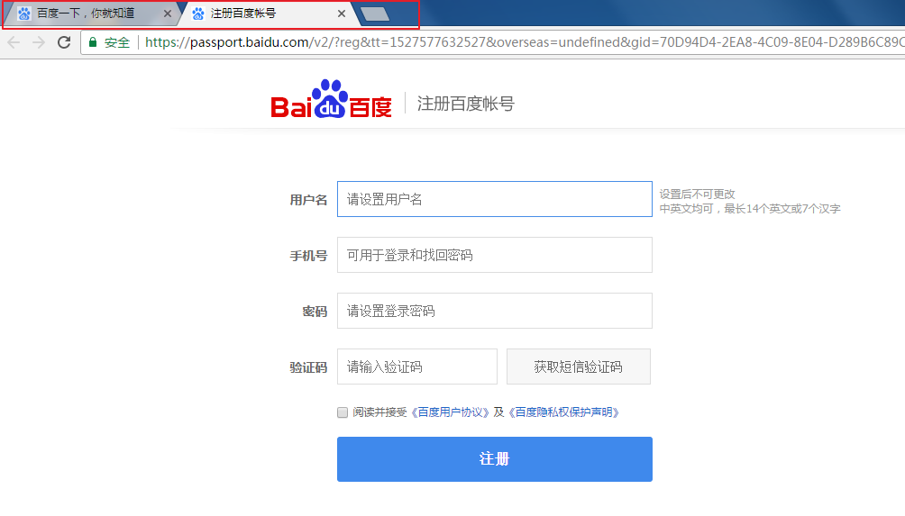
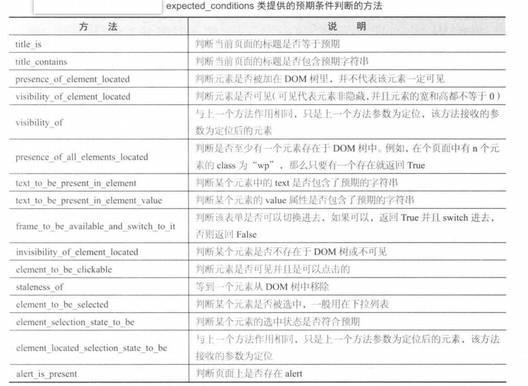
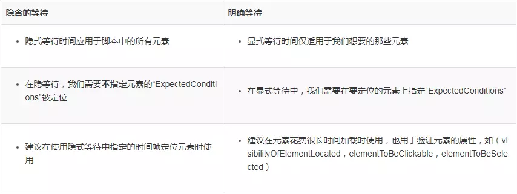

# Selenium自动化测试工具

### Selenium简介

**Selenium是一款基于浏览器用于Web应用程序自动化测试的工具。**

通俗点说，**用户能做的一切，无论有无界面、输入、点击、滑动等其他操作，Selenium驱动浏览器都能做**。

##### Selenium爬虫

通常各大网站都会有一定的反爬机制，既为了数据安全，也为了减小服务器压力。**反爬的方向就是，识别非浏览器客户端，而selenium恰恰是让真正的浏览器去执行请求和操作，对于服务端来说，是没有任何差别的。**

对于数据加密或放在不同地方的网页，通过 Selenium **获取数据加载完成后的页面的源代码**，做到可见即可爬。**选择selenium来做爬虫，也说明网站的反爬能力比较高，**但要是开几十个浏览器窗口去获取网页源码，**作为爬虫确实比较慢了**。

**优点**：被反爬几率小，能运行Js，可以爬取反爬较严的网站。

**缺点**：加载耗时，效率低，稳定性差。

##### 运行模式

**有头模式(默认)**：浏览器运行时，显示浏览界面的模式。

**无头模式**：浏览器运行时，不显示浏览界面的模式。

?> 浏览器运行时，默认有头模式，设置无头模式，需要在Selenium中设置options参数。

### Driver驱动程序

为了方便理解，打个比方，浏览器好比汽车，Driver就是车钥匙，来启动汽车，Selenium就是司机，驾驶汽车。

!> 使用驱动程序，首先要保证被驱动的浏览器安装到位了。

##### Chromedriver

**Chromedriver是驱动Chrome(谷歌)浏览器的程序。**

Chromedriver下载链接：http://npm.taobao.org/mirrors/chromedriver/2.41/ ，选择符合符合自己电脑操作系统的版本进行下载。**将文件解压到环境变量下的路径**或者**在 `executable_path` 参数来指定Chromedriver文件的路径**。

##### Geckodriver

**Geckodriver是驱动Firefox(火狐)浏览器的程序。**

Geckodriver下载链接：https://github.com/mozilla/geckodriver/releases ，选择符合符合自己电脑操作系统的版本的Geckodriver，进行下载，完成后解压，后面步骤和安装Chromedriver一样。

##### 驱动浏览器详解

1. 使用相同的程序和相同版本Chromedriver操作不同版本的Chrome浏览器有时候会报错，原因五花八门。

2. 使用Chromedriver驱动Chrome浏览器去访问**部分网站**，其接口可能会状态码错误，返回空白页，原因未知，而使用Geckodriver驱动Firefox浏览器访问没有问题。

3. **Firefox浏览器没有设置快速缓存和自动释放内存，在长时间使用Firefox时，它所占用的内存量也会随时间不断增加，所以应该考虑定期地重新启动Firefox，让它维持在一个固定的内存占用量。**Firefox设置快速缓存(默认情况下，Firefox只会使用系统内存而不会使用快速缓存)

   ```
   操作步骤：
   　　1.打开Firefox浏览器，在地址栏中输入about:config，在过滤器中输入browser.cache.memory.enable，双击这个项目更改它的值为true。
   　　2.在浏览器中右键点击后选择新建>整数，输入browser.cache.memory.capacity后点击确定。
   　　3.下一步需在此输入一个值，而这个值的大小则取决于你计算机物理内存的大小。如果你的内存大小为256MB，则输入4096，如果你的内存大小为512MB的话，则输入8192。如果你的内存是128MB甚至更低，建议升级内存。
   　　(如果要恢复默认设置，将browser.cache.memory.capacity”的值改为-1)
   ```

**提醒：后面所有的Selenium例子都是基于Chromedriver驱动和Chrome浏览器写的，和其他驱动程序和浏览器操作都大同小异，但不建议使用Chromedriver驱动和Chrome浏览器，强烈推荐Geckodriver驱动和Firefox浏览器。**

### 基本操作

浏览器已经驱动起来了，现在就要使用Selenium库来操作浏览器的执行点击、输入等各种事件。

##### 声明浏览器对象

```python
# 导入selenium的浏览器驱动接口webdriver
from selenium import webdriver

# selenium支持非常多的浏览器，如Chrome、Firefox、Safari等（运行前提是环境变量中存在该浏览器的驱动）
browser = webdriver.Chrome()
browser = webdriver.Firfox()
browser = webdriver.Safari()
# 注意：浏览器首字母大写
```

##### 获取网页代码

默认为有头模式，运行代码后，会有谷歌浏览器弹出，访问页面：

```python
# 导入selenium的浏览器驱动接口webdriver
from selenium import webdriver

# 声明初始化的浏览器为Chrome（谷歌浏览器）
browser = webdriver.Chrome()

# get方法访问传入url
browser.get('https://www.taobao.com')

# page_source方法输出网页的源代码
print(browser.page_source)

# 关闭浏览器
browser.close()

'''
输出：
<title>淘宝网 - 淘！我喜欢</title>
<meta name="spm-id" content="a21bo" />
<meta name="description" content="淘宝网 - 亚洲较大的网上交易平台，提供各类服饰、美容、家居、数码、话费/点卡充值… 数亿优质商品，同时提供担保交易(先收货后付款)等安全交易保障服务，并由商家提供退货承诺、破损补寄等消费者保障服务，让你安心享受网上购物乐趣！" />...
'''
```

##### Options参数配置

使用Chromedriver驱动chrome浏览器爬取网站信息时，**默认情况下就是一个普通的纯净的chrome浏览器，还需要对这个chrome做一些特殊的配置，以满足爬虫的行为**。

Options 就是一个**配置 chrome 启动时属性的类**。通过**添加启动参数 (add_argument)、添加实验性质的设置参数 (add_experimental_option)等参数**，来配置chrome的属性：

- 禁止图片和视频的加载：提升网页加载速度。
- 添加代理**：**用于翻墙访问某些页面，或者应对IP访问频率限制的反爬技术。
- 使用移动头：访问移动端的站点，一般这种站点的反爬技术比较薄弱。
- 设置编码：应对中文站，防止乱码。

```python
# 导入chrome中Options配置选项
from selenium.webdriver.chrome.options import Options

# 建立Option类对象
chrome_options = Options()

# '--headless'设置为无头模式
chrome_options.add_argument('--headless')

# 设置默认编码为 utf-8，也就是中文
chrome_options.add_argument('lang=zh_CN.UTF-8')

# 设置头部user-agent
chrome_options.add_argument('user-agent="Mozilla/5.0 (iPod; U; CPU iPhone OS 2_1 like Mac OS X; ja-jp) AppleWebKit/525.18.1 (KHTML, like Gecko) Version/3.1.1 Mobile/5F137 Safari/525.20"')
# 模拟iPhone 6，移动端的网站的反爬能力较弱
chrome_options.add_argument('user-agent="Mozilla/5.0 (iPhone; CPU iPhone OS 9_1 like Mac OS X) AppleWebKit/601.1.46 (KHTML, like Gecko) Version/9.0 Mobile/13B143 Safari/601.1"')

# 设置代理（注意：等号两边不能有空格）
chrome_options.add_argument("--proxy-server=http://202.20.16.82:10152")

# 禁止加载图片
chrome_options.add_argument('blink-settings=imagesEnabled=false')

# 携带Cookie
chrome_options.add_argument("user-data-dir=selenium") 

# 防屏蔽检测
chrome_options.add_experimental_option('excludeSwitches', ['enable-automation'])

# 阻止js
prefs = {'profile.default_content_setting_values': {'javascript': 2,}}
chrome_options.add_experimental_option('prefs', prefs)

# 禁止加载图片
prefs = {'profile.default_content_setting_values': {'images': 2,}}
chrome_options.add_experimental_option('prefs', prefs)

# 启用配置（上面的配置不启动，就无效）
browser = webdriver.Chrome(options=chrome_options)
```

!> 凡是配置参数，就必须通过 `options=chrome_options` 来启用配置，否则就是无效配置。

##### 定位结点

Selenium可以完成模拟点击、输入框输入文字等各种操作，完成这些操作就需要定位节点。Selenium 提供了一系列查找节点的方法，利用这些方法来获取想要的节点。

**单节点(find_element_by...)**：通过**节点属性定位到单节点**。

```python
# 选择name为q的节点
browser.find_element_by_name('q')

# 选择id为q的节点
browser.find_element_by_id('q')

# 利用css选择器选择id为q的节点
browser.find_element_by_css_selector('#q')

# 利用xpath选择器选择id为q的节点
browser.find_element_by_xpath('//*[@id="q"]')

# 利用节点文本内容来查找q节点
browser.find_element_by_link_text('下一页')
```

**多节点(find_elements_by...)**：通过**下标定位多节点里的单节点**，`browser.find_elements_by('...')[N]`。

!> 单个节点是find_element...，多个节点是find_elements...(多一个s)。

```python
from selenium import webdriver

browser = webdriver.Chrome()

browser.get('https://www.taobao.com')

# css多节点选择
last1 = browser.find_elements_by_css_selector('.service-bd li')
print(last1)

# xpath多节点选择
last2 = browser.find_elements_by_xpath('//*[@class="service-bd"]/li')
print(last2)

'''
输出：(这里没有用下标定位，直接输出多节点)
[<selenium.webdriver.remote.webelement.WebElement (session="ab0c34c539d914394c1e51d789349796", element="0.02681066407470678-3")...]
[<selenium.webdriver.remote.webelement.WebElement (session="ab0c34c539d914394c1e51d789349796", element="0.02681066407470678-3")...]
'''
```

##### 获取节点属性

```python
from selenium import webdriver

browser = webdriver.Chrome()

browser.get('https://www.zhihu.com/explore')

# 定位到id为zh-top-link-logo的节点
logo = browser.find_element_by_id('zh-top-link-logo')
# 输出logo节点对象
print(logo)							# <selenium.webdriver...>
# 输出logo节点的class属性
print(logo.get_attribute('class'))	# zu-top-link-logo
# 通过text属性获取文本内容
print(logo.text)					# 提问
# 通过location属性获取到节点在页面中的相对位置
print(logo.location)				# {'x': 761, 'y': 7}
# 通过tag_name属性可以获取到标签名称
print(logo.tag_name)				# button
# 通过size属性可以获取到节点的大小
print(logo.size)					# {'height': 32, 'width': 66}
```

### 其他操作

##### 刷新、前进、后退、退出

浏览器基本功能， Selenium 也可以完成：

```python
# 刷新当前窗口
browser.refresh()

# 前进到下一个访问的页面
browser.forward()

# 后退到上一个访问的页面
browser.back()

# 如果打开了多个窗口，则关闭当前窗口；如果只打开一个窗口，则退出浏览器
browser.close()

# 关闭所有窗口，退出浏览器，
browser.quit()
```

##### 全选、剪切、输入、点击

```python
import time
from selenium import webdriver
# 调用键盘按键操作引入keys包
from selenium.webdriver.common.keys import Keys

browser = webdriver.Chrome()

# 访问“百度”
browser.get('https://www.baidu.com')

# id="kw"是百度搜索输入框，输入框中输入字符串"程序猿"
browser.find_element_by_id('kw').send_keys('程序猿')
time.sleep(2)
# ctrl+a 全选输入框内容
browser.find_element_by_id("kw").send_keys(Keys.CONTROL, 'a')
time.sleep(2)
# ctrl+x 剪切输入框内容
browser.find_element_by_id("kw").send_keys(Keys.CONTROL, 'x')
time.sleep(2)
# 输入框中输入字符串"程序员"
browser.find_element_by_id('kw').send_keys('程序员')
time.sleep(2)
# id="su"是百度搜索按钮，click() 是模拟点击
browser.find_element_by_id("su").click()
time.sleep(2)
```

##### 窗口截屏

只针对**窗口显示的部分网页**进行截屏，有头模式和无头模式都能进行截屏：

```python
from selenium import webdriver
from selenium.webdriver.chrome.options import Options
# 创建设置类
chrome_options = Options()
# 设置无头模式
chrome_options.add_argument('--headless')
# 启用配置
browser = webdriver.Chrome(options=chrome_options)
# 访问百度页面
browser.get('https://www.baidu.com')
# 生成当前页面快照并保存
browser.save_screenshot("baidu.png")
```

##### 窗口句柄

**活动窗口**：即**当前的工作窗口**。**有多个打开的窗口时，只有一个是活动窗口，它位于最上层，不被其他窗口遮挡。**

我们在操作网页时，点击某些页面链接，就会打开一个新的窗口，我们要在新页面上操作，就得将活动窗口切换到新窗口上。比如，百度首页登录框点击注册，会打开一个新的注册页面，要在新页面注册，就得先切进新页面。



我们可以通过浏览器的显示来判定哪一个是活动窗口，**对于程序来说，则是通过句柄来判断哪一个是活动窗口**。

**句柄**：浏览器上**每个窗口都有的唯一属性**。

这里就会产生一个问题，**我们看到的活动窗口，不一定就是程序的活动窗口**。说的仔细的点：使用 Selenium打开一个网页，通过 `page_source` 输出的就是该网页的代码，若 Selenium 再打开一个新的网页，我们虽然看到浏览器的活动窗口在新的网页上，但 `page_source` 输出的仍然是第一个网页的代码，**这就是因为程序没有切换到新网页上的句柄，认为活动窗口还在第一个网页上。**

网页打开顺序：`1 2 3 4 5`；对应的句柄 ：`0 4 3 2 1`

?> 第一个打开网页，句柄一直是0。

?> 最新打开的网页，句柄一直是1，从右往左依次递增编号。

```python
# 访问网页
browser.get('...')
# 输出当前窗口的网页源码
print(browser.page_source)
# 点击链接产生新窗口新页面
browser.find_element_by_xpath(...).click()
# 获取窗口句柄
n = browser.window_handles
# 切换到新网页的句柄，即n[1]为活动窗口
browser.switch_to.window(n[1])
# 输出活动窗口网页源码
print(browser.page_source)
```

##### Cookies操作

获取、添加、删除 Cookies等。

```python
from selenium import webdriver

browser = webdriver.Chrome()

browser.get('https://www.zhihu.com/explore')

# get_cookies()方法获取所有的cookies
print(browser.get_cookies())

# 添加一个cookie，传入一个字典，有name、domain等内容
browser.add_cookie({'name':'name','domain':'www.zhihu.com','value':'germey'})
print(browser.get_cookies())

# delete_all_cookies()删除所有的cookies
browser.delete_all_cookies()
print(browser.get_cookies())

'''
输出：
[{'domain': ...]
[{'domain': ... {'domain': 'www.zhihu.com', 'name': 'name', 'value': 'germey'}]
[]
'''
```

##### Iframe定位

有时候驱动了浏览器去爬取网页，元素明明在那，浏览器中也可以看到，但就是抓取不到，`page_source` 输出的源码中也没有该元素，这个时候就需要**检查下页面是否含有iframe，如果你需要定位的元素是否在iframe之中，有可能就是因为iframe的问题**。

**iframe**：**内嵌的网页元素，也可以说是内嵌的框架**，可以将一个HTML文档嵌入在另一个HTML中显示。

**有的网页看起来是一个HTML文档，但实际上iframe嵌入了另一个页面，而webdriver每次只能识别一个页面，如果你需要定位的元素是否在iframe之中，就需要先定位到相应的iframe，对那个页面里的元素进行定位。**

```python
# 跳转到iframe框架，可以使用xpath定位，然后传入
browser.switch_to.frame('...')

# 再通过xpath进行定位元素
browser.find_element_by_xpath('')

# 返回到上一个文档
browser.switch_to.parent_frame()

# 退回到主文档，切换进入frame之中后，我们就不能对主文档的元素进行操作了，如果要操作，那么只能再切换回去
browser.switch_to.default_content()
```

### 延时等待

前面强调过，**Selenium 获取数据加载完成后的页面的源代码，而`浏览器对象.get()` 方法会在网页框架加载结束后完成执行，此时获取 `page_source` ，可能并不是浏览器完全加载完成的页面**，如有额外的 Ajax 请求、js加载，在网页源代码中也不一定能成功获取到。**所以需要延时等待，确保节点已经加载出来**。

##### 强制等待

**强制等待**：**设置固定休眠时间**。 Python 内置的 time 包提供 sleep 方法， 就可以使脚本的执行过程进行休眠。

```python
import time
# 导入浏览器驱动
from selenium import webdriver

browser = webdriver.Chrome()

browser.get('https://www.hapag-lloyd.cn/zh/home.html#hal-map')

# 获取网页代码
print(browser.page_source)
print('=============================================================================')
# 暂停10秒
time.sleep(10)
# 获取网页代码
print(browser.page_source)

'''
输出：
...<script>
(function(){
window["bobcmn"] = "111110101010102000000022000000052000000002d35d0af5200000096300000000300000000300000006/TSPD/300000008TSPD_101300000005https3000000b0081ecde6...
</script>...

================================================================================

...</script>
<div id="hal-cookieconsent" class="hal-cookienotice" style="display: block;">
	<div class="hal-cookienotice-info">
		<p class="hal-cookienotice-info-text">我们使用Cookies来确保带给您网站的最佳体验。如果选择继续，将代表您同意接收这些Cookies。有关Cookie的详细信息，请参阅我们的<a href="/zh/meta/cookie-policy.html" class="hal-link hal-cookienotice-info-link" btattached="true">Cookie 政策</a>和...
		
解释：
上面两次打印的结果不一样，是因为Selenium加载网页后马上获取的网页代码是未加载Js的，而Js能改变网页内容，在等待10秒后Js加载完毕，这时再执行获取网页代码的方法，获取的就是加载Js的网页代码。
'''
```

!> 强制等待有一个缺点就是，元素即使被很快的加载出来了，也还是要等待固定的休眠时间。

##### 显式等待

**显式等待**：**通过 `WebDriverWait()` 配合该类的 `until()` 或 `until_not()` 方法，针对于某个特定的元素设置的等待时间，**。在设置时间内，默认每隔0.5s检测一次，如果条件成立，则执行下一步，否则继续等待，直到超过设置时间，然后抛出 `TimeoutException` 错误。引入路径：

```python
# 导入WebDriverWait，设置延时等待
from selenium.webdriver.support.ui import WebDriverWait

# 每个元素的等待时间统一设置为10秒
wait = WebDriverWait(浏览器对象, 10)
```

在 Selenium 中内置的一个 `By` 类，在这个类中有各种方法**通过元组**来定位元素。引入路径：

```python
# 从selenium.webdriver.common.by 导入By包进行元素定位
from selenium.webdriver.common.by import By 

# By所支持的定位器的分类
CLASS_NAME = 'class name'
CSS_SELECTOR = 'css selector'
ID = 'id'
LINK_TEXT = 'link text'
NAME = 'name'
PARTIAL_LINK_TEXT = 'partial link text'
TAG_NAME = 'tag name'
XPATH = 'xpath'

# 定位ID为q的节点
(By.ID, 'q')
# 定位CSS为btn-search的节点
(By.CSS_SELECTOR, '.btn-search')
```

既然是针对元素的等待，那么如何判断一个元素是否存在？在 Selenium 的 `expected_conditions` 模块收集了一系列的场景判断方法。引入路径和方法：

```python
# expected_conditions一般也简称为EC
from selenium.webdriver.support import expected_conditions as EC

# 判断当前页面的title是否包含预期字符串，返回布尔值
EC.title_contains(u"字符串")

# 判断某个元素是否被加到dom树下(因为参数必须是可迭代的，所以用By类的元组)
EC.presence_of_element_located((By..., '...'))

# 判断某个元素中是否可见并且是enable的(因为参数必须是可迭代的，所以用By类的元组)
EC.element_to_be_clickable((By..., '...'))

# 判断某个元素是否被选中了,一般用在下拉列表(因为参数必须是可迭代的，所以用By类的元组)
EC.element_to_be_selected((By..., '...'))
```



爬取淘宝网时的显式等待：

```python
from selenium import webdriver
# 导入Selenium的定位的By类
from selenium.webdriver.common.by import By
# 导入WebDriverWait，设置延时等待
from selenium.webdriver.support.ui import WebDriverWait
# 将导入的expected_conditions重命名为EC
from selenium.webdriver.support import expected_conditions as EC

browser = webdriver.Chrome()

browser.get('https://www.taobao.com/')

# 每个元素的等待时间统一设置为10秒
wait = WebDriverWait(browser, 10)

# 在10秒内如果ID为q的节点成功加载出来，就返回该节点；如果超过10秒还没有加载出来，就抛出异常
search = wait.until(EC.presence_of_element_located((By.ID, 'q')))
print(search)

# 10秒btn-search节点是可点击的，就返回这个节点；如果超过10秒不可点击，就抛出异常。
button = wait.until(EC.element_to_be_clickable((By.CSS_SELECTOR, '.btn-search')))
print(button)

'''
输出：
<selenium.webdriver.remote.webelement.WebElement (session="93257f160f06ca43cdf970e6e4d7ef34", element="0.24301452802066237-1")> <selenium.webdriver.remote.webelement.WebElement (session="93257f160f06ca43cdf970e6e4d7ef34", element="0.24301452802066237-2")>
'''
```

##### 隐式等待

**隐式等待**：**通过 `implicitly_wait()` 设置的全局等待时间，是对页面中的所有元素设置加载时间，如果超出了设置时间的则抛出 `NoSuchElementException` 异常**。可以理解成在规定的时间范围内，浏览器在不停的刷新页面，直到找到相关元素或者时间结束。

?> `浏览器对象.implicitly_wait()` 等待时间默认设置为0

?> `浏览器对象.implicitly_wait(10)` 元素在10s内定位到了，则继续执行；否则，就抛出异常。

```python
from selenium import webdriver

browser = webdriver.Chrome()

browser.get('http://www.baidu.com')

# 隐式等待10秒
browser.implicitly_wait(10)
```

显式等待和隐式等待区别：



### 极验验证码

破解极验验证码的思路在[爬虫12-验证码](爬虫12-验证码.md)中的“极验验证码”，给出代码之前，先讲解一下需要用到的操作：

##### 行为事件

行为事件：`actionchains` 是selenium里面专门处理鼠标相关的操作如：鼠标移动，鼠标按钮操作，按键和上下文菜单（鼠标右键）交互。

```python
from selenium import webdriver
# 导入ActionChains行为事件
from selenium.webdriver import ActionChains

# 浏览器对象
browser = webdriver.Chrome()
# 滑块对象
slider = find_element_by_id('...')
# 滑动链表
track = [0, 0, 0, 1, 1, 1, 1, 1, 1, 2, 2, 2, 2, 2, 2, 2]
# click_and_hold保持按住并滑动
ActionChains(browser).click_and_hold(slider).perform()
# 滑动距离就是滑动链表中的值
for x in track:
    # xoffse水平位移, yoffset垂直位移
    ActionChains(browser).move_by_offset(xoffset=x, yoffset=0).perform()
time.sleep(0.5)
ActionChains(browser).release().perform()

# 对于下拉列表，使用move_to_element移动到该元素，一层一层的指向
# 移动到button1
button1 = wait.until(EC.presence_of_element_located((By..., '...')))
ActionChains(browser).move_to_element(button1).perform()
# 移动到button1下的button2
button2 = wait.until(EC.element_to_be_clickable((By..., '...')))
ActionChains(browser).move_to_element(button2).perform()
# 移动到button1下的button2下的button3
button3 = wait.until(EC.element_to_be_clickable((By..., '...')))
ActionChains(browser).move_to_element(button3).perform()
# 点击button3
button3.click()
```

##### 模拟Js

Selenium 还可以使用 `execute_script` 方法来模拟运行JavaScript。

```python
# 将进度条下拉到最底部
浏览器对象.execute_script('window.scrollTo(0, document.body.scrollHeight)')

# 弹出alert提示框，内容是（To Bottom）
浏览器对象.execute_script('alert("To Bottom")')
```

##### 破解极验验证码

这里没有具体举例破解哪个网站极验验证码，但主体代码已经给出来了，后面根据不同的网站增添部分代码：

```python
from io import BytesIO
from PIL import Image
from selenium import webdriver
from selenium.webdriver import ActionChains
from selenium.webdriver.common.by import By
from selenium.webdriver.support.ui import WebDriverWait
from selenium.webdriver.support import expected_conditions as EC

# 建立CrackGeetest类
class CrackGeetest:
    # 滑块距离左边界的距离
    BORDER = 6

    def __init__(self, obj):
        self.browser = obj
        # 显示等待，设置元素统一等待时间30秒
        self.wait = WebDriverWait(self.browser, 30)

    # 模拟人类滑动滑块的滑动轨迹(涉及初中物理上的匀加速运动)
    def get_track(self, distance):
        # 空的滑动链表
        track = []
        # 位移距离
        current = 0
        # 间隔时间
        t = 0.5
        # 初速度
        v = 0
        while current < distance:
            if current < distance * 4 / 5:
                # 当前位移小于整个位移的4/5时，加速度为2
                a = 2
            else:
                # 当前位移大于整个位移的4/5时，加速度为-3
                a = -3
            # 上次位移的末速度，等于这次的初速度
            v0 = v
            # 在时间t时的速度
            v = v0 + a * t
            # 在时间t内的位移
            move = v0 * t + 1 / 2 * a * t * t
            # 已经位移的总距离
            current += move
            # 将时间t内的位移近似值，加入到滑动链表中
            track.append(round(move))
        return track

    # 遍历坐标，对比像素点RGB值
    def is_pixel_equal(self, image1, image2, x, y):
        # 根据每个坐标获取像素点RGB值
        pixel1 = image1.load()[x, y]
        pixel2 = image2.load()[x, y]
        # 阈值为60，当RGB值偏差超过60，认为像素点不一样
        threshold = 60
        # 对比RGB值偏差的绝对值，大于60，则找到不一样的像素点，认为找到了缺口阴影部分，返回False
        if abs(pixel1[0] - pixel2[0]) < threshold and abs(pixel1[1] - pixel2[1]) < threshold and abs(pixel1[2] - pixel2[2]) < threshold:
            return True
        else:
            return False

    # 获取缺口偏移量
    def get_gap(self, image1, image2):
        # 滑块最右边距离验证码最左边的位置大体距离为60
        left = 60
        # 遍历滑块最右边至验证码码最右边的部分，找出缺口阴影最左边的位置坐标(注意是：缺口阴影最左边)
        for i in range(left, image1.size[0]):
            for j in range(image1.size[1]):
                if not self.is_pixel_equal(image1, image2, i, j):
                    # 返回阴影缺口最左边的横坐标
                    left = i
                    return left - 2
        return left

    # 获取背景带缺口的验证码图片
    def get_geetest_image1(self):
        # 执行js，让验证码只显示带有背景缺口的图片
        js = f'''...'''
        self.browser.execute_script(js)
        # 获取整个网页截图
        screenshot = self.browser.get_screenshot_as_png()
        screenshot = Image.open(BytesIO(screenshot))
        # 获取验证码在屏幕的坐标
        img = self.browser.find_elements_by_xpath('...')
        location = img.location
        size = img.size
        top, bottom, left, right = location['y'], location['y'] + size['height'], location['x'], location['x'] + size['width']
        # 根据坐标在整个网页截图中裁剪出验证码图片，并保存图像为'captcha1.png'
        captcha = screenshot.crop(left, top, right, bottom)
        captcha.save('captcha1.png')
        return captcha

    # 获取背景不带缺口的验证码图片
    def get_geetest_image2(self):
        # 执行js，让验证码显示不带有缺口的背景图片
        js = f'''...'''
        self.browser.execute_script(js)
        # 获取整个网页截图
        screenshot = self.browser.get_screenshot_as_png()
        screenshot = Image.open(BytesIO(screenshot))
        # 获取验证码在屏幕的坐标
        img = self.browser.find_elements_by_xpath('...')
        location = img.location
        size = img.size
        top, bottom, left, right = location['y'], location['y'] + size['height'], location['x'], location['x'] + size['width']
        # 根据坐标在整个网页截图中裁剪出验证码图片，并保存图像为'captcha2.png'
        captcha = screenshot.crop(left, top, right, bottom)
        captcha.save('captcha2.png')
        return captcha

    # 破解验证码
    def crack(self):
        # 等待极验验证码加载完成
        self.wait.until(EC.presence_of_element_located((By.CLASS_NAME, '...')))
        # 获取滑块对象
        slider = self.browser.find_elements_by_xpath('...')
        # 获取带缺口的验证码图片
        image1 = self.get_geetest_image1()
        # 获取不带缺口的验证码图片
        image2 = self.get_geetest_image2()
        # 将带缺口验证码和不带缺口验证码进行比对，获取缺口位置
        gap = self.get_gap(image2, image1)
        # 减去距离左边界的距离，就等于滑块的位移距离
        gap -= self.BORDER
        # 根据距离，计算模拟人类滑动滑块的运动轨迹，获得滑动链表
        track = self.get_track(gap)
        # 传入浏览器对象和滑块对象
        ActionChains(self.browser).click_and_hold(slider).perform()
        # 遍历滑动链表
        for x in track:
            # 按住并拖动滑块，根据滑动链表里面的值移动相同的距离
            ActionChains(self.browser).move_by_offset(xoffset=x, yoffset=0).perform()
        # 松开滑块，和缺口重合
        ActionChains(self.browser).release().perform()
        # 验证通过
        print('验证通过')

def all_event():
    # 创建浏览器对象
    browser = webdriver.Chrome()
    # 访问含有滑块验证码的网址
    browser.get('...')
    # 通过浏览器对象生成crack类对象
    gee = CrackGeetest(obj=browser)
    # 点击按钮生成极验验证码
    browser.find_element_by_xpath('...').click()
    # 执行类中的crack()的方法，破解验证码
    gee.crack()


if __name__ == '__main__':
    all_event()
```


