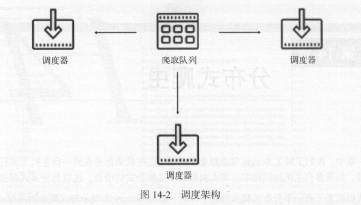
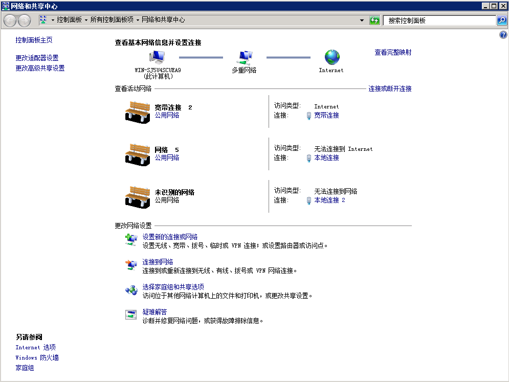
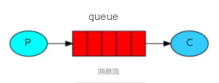

# 分布式爬虫

前面提到过，一个爬虫只运行在一个主机上，就算效率再怎么高，面对需要采集量巨大的任务时，仍然会显得力不从心。**假如，我们将爬虫分布到多台主机上，再共享一个消息队列，那么采集效率就会翻倍，这就是“分布式爬虫”。**

## 技术原理

### 分布式爬虫原理

Scrapy框架中，每个爬虫都有一个自己的request队列（消息队列）和一个自己的调度器，当爬虫启动以后，调度器从消息队列中获取request给爬虫进行爬取。


如果两个调度器同时从消息队列里面取 Request ，在带宽足够、正常爬取且不考虑队列存取压力的情况下，那么其爬取效率会翻倍。这样，调度器可以扩展多个，下载器也可以扩展多个，**而爬取队列 Queue 必须始终为1个，也就是所谓的共享爬取队列。这样才能保证调度器从队列里调度某个 Request 后，其他调度器不会重复调度此 Request ，就可以做到多个调度器同步爬取。这就是分布式爬虫的基本雏形。**



我们需要做的就是在多台主机上同时运行爬虫任务协同爬取，而协同爬取的前提就是共享爬取队。**这样各台主机就不需要各自维护爬取队列，而是从共享爬取队列存取 Request。但是各台主机还是有各自的调度器和下载器，所以调度和下载功能分别完成。**如果不考虑队列存取性能消耗，爬取效率还是会成倍提高。

### VPS技术

上面首先就提到了，分布式爬虫需要使用到多台主机，这里的主机并不是指硬件上的一台主机，也可以是虚拟主机，本着充分利用计算机资源的原则，VPS技术派上用场了。

VPS技术：**Virtual Private Server 虚拟专用服务器，将一台服务器分割成多个虚拟专享服务器的优质服务。在容器或虚拟机中，每个VPS都可选配独立公网IP地址、独立操作系统、实现不同VPS间磁盘空间、内存、CPU资源、进程和系统配置的隔离，为用户和应用程序模拟出“独占”使用计算资源的体验。VPS可以像独立服务器一样，重装操作系统，安装程序，单独重启服务器。**

**简单理解，VPS就是通过虚拟化技术隔离出来的系统。**


上面的VPS都是通过**VMWare虚拟机软件**将物理主机的资源划分出来的，在一台物理主机上面装了3个虚拟机。



在一台物理主机上面有多张网卡，每台虚拟主机可配置一张有线网卡进行单独拨号，因此每台虚拟主机的外网地址是不一样的。例如：

```
第一台虚拟主机的内网地址为192.168.0.11，外网地址为101.204.79.xxx
第二台虚拟主机的内网地址为192.168.0.12，外网地址为101.204.121.xx
```

### 远程桌面连接

有了服务器我们还需要软件来连接这些服务器，使用的软件在上图中已有所展示，这里就不再展示了。

软件的名称：Remote Desktop Connection Manager(远程桌面管理工具)。

下载地址：[Remote Desktop Connection Manager](https://remotedesktopmanager.com/)

Remote Desktop Connection Manager能够集中管理多个远程桌面连接，并可在多个同时打开的远程面桌面间快速切换。而且即使我们重装了系统或在其他PC上也能快速载入这些常用的远程桌面。这对于管理需要定期访问每台机器（例如自动检入系统和数据中心）的服务器实验室非常有用。服务器被组织为命名组。您可以使用单个命令连接或断开连接到一个组中的所有服务器。您可以按一组缩略图查看组中的所有服务器，并在每个会话中显示实时操作。服务器可以从父组或凭据存储继承其登录设置。因此，当您更改实验室帐户密码时，只需在一个位置更改RDCMan存储的密码。通过使用（本地）登录的用户权限或X509证书使用CryptProtectData进行加密，可以安全地存储密码。

## 消息队列

前面提到，多线程爬虫、协程爬虫在很大程度上提升了采集的效率，这两种爬虫都使用了相同的“策略”，**将所有要爬取的链接先获取下来，用列表存储，再启动爬虫程序，不重复的获取链接，省掉了其他爬虫等待链接的时间和本身的闲置时间，因此能成倍提升采集效率。**这里存储链接的列表，就可以称之为**消息队列**。

### 消息队列简介

消息队列：**简称MQ，是一种应用间的通信方式，消息发送后可以立即返回，由消息系统来确保消息的可靠传递。**

**消息队列作用**：在高并发环境下，由于来不及同步处理，请求往往会发生堵塞，**通过使用消息队列，我们可以异步处理请求，从而缓解系统的压力**。

#### 模型组成

生产者(producer)：**发送消息的程序。**


队列(queue)：**存储消息的队列。** 一个队列只受到主机的内存和磁盘的限制，它实际上是个大的消息缓冲区。


消费者(consumer)：**等待接收消息的程序**。


#### 模型流程

生产者(producer)创建消息，然后发布到队列(queue)中，最后将消息发送到监听的消费者(consumer)。



?> 多个生产者可以发送消息到一个队列，多个消费者可以从队列中接收数据。

?> 生产者只管把消息发布到队列中不管谁来取，消费者只管从队列中取消息而不管是谁发布的。这样发布者和使用者都不用知道对方的存在。

!> 消息队列的特点是：**阅后即焚**。当消费者使用了消息队列里面的消息后，消息队列里面的消息就被销毁了。

### 消息队列模块

#### Queue队列

线程队列模块 `queue`：**用于多线程，它可以指定缓冲区大小的阻塞队列**。

```python
import queue

# 创建一个线程队列
q = queue.Queue()
```

!>  `queue` 模块生成的线程队列，在多进程模式下，数据无法在多个进程之间共享。

进程队列模块 `multiprocessing`：**用于多进程，它通过管道以及锁和信号量机制来协调多个进程。**

```python
import multiprocessing

# 创建一个进程队列
q = multiprocessing.Queue()
```

!>  `multiprocessing` 模块生成的进程队列，可以在多进程之间共享同一个变量的数据

#### 插入、获取、顺序

```python
import queue

# 创建线程队列，Queue先进先出模式
q1 = queue.Queue()

for i in range(3):
	# 向队列q中插入变量数据i
    q1.put(i)

# get()获取数据，每次get只能取一个数据
print(q1.get())		# 0
print(q1.get())		# 1
print(q1.get())		# 2


# 创建线程队列，LifoQueue先进后出模式
q2 = queue.LifoQueue()

for i in range(3):
	# 向队列q中插入变量数据i
    q2.put(i)

print(q2.get())		# 2
print(q2.get())		# 1
print(q2.get())		# 0
```

#### 长度、上限、阻塞

```python
import queue

q = queue.Queue()

# empty()判断队列是否为空
print(q.empty())	# True
# 获取队列q的长度
print(q.qsize())	# 0

for i in range(5):
    q.put(i)

# empty()判断队列是否为空
print(q.empty())	# False
# 获取队列q的长度
print(q.qsize())	# 5
```

**`maxsize` 参数：参数表示队列中能存放的数据个数的上限；默认等于0，表示队列大小没有限制。**

```python
import queue

# 创建一个长度为4的队列
q = queue.Queue(maxsize=4)

# 插入数据0，1，2，3后，消息队列数据达到上限，发生阻塞，不会执行下面的print语句。
for i in range(5):
    q.put(i)	
print('程序结束')
```

!> 数据量一旦达到上限，插入会导致阻塞，直到队列中的数据被消费掉。

```python
import queue

# 创建一个长度为4的队列
q = queue.Queue(maxsize=4)

for i in range(5):
    q.put(i)
    print(q.get())	
print('程序结束')	

'''
输出：
0 1 2 3 4
程序结束

解释：put(i)插入一次数据，get()获取一次数据，数据量不会达到队列上限4，能执行print语句。
'''
```

?> `queue` 和 `multiprocessing` 模块，两者 `Queue` 队列的 `get`、`put`、`empty`、`qsize` 等方法名称是相同的。

### Redis消息队列

**Redis是时下比较火的内存数据库，以简单高效著称，具有丰富的数据类型，常用于缓存数据，也支持队列queue，我们可以将Redis作为message broker（消息中间人）。**

Redis目前只能实现简单的消息队列功能，它所具有的优点：

- 极低延迟：得益于Redis本身的高效，消息可以极低延迟传递。
- 上手容易：只需组合使用两三个命令，即可完成消息传递。
- 查看便利：可以便利地查看队列内容；利用 `MONITOR` 命令甚至可以实时监控消息入队和出队。
- 单线程锁：**Redis本身是一个单线程的，相当于所有操作都有一把天然的排他锁，因此我们不用担心在并发下同一条消息会传递给多个使用者**。

#### 可靠消息队列

可靠消息队列：**由两个列表组成，一个存储待处理（`pending`）的消息，另一个存储处理中（`processing`）的消息。**

1. 生产者将所有任务添加至待处理列表里面
2. 消费者从待处理列表里面获取任务，并将该任务添加至处理中列表
3. 消费者成功处理任务后，再将处理中列表里面的任务删除

使用可靠消息队列的优势在于，可以防止处理异常，而导致任务丢失。详情请阅读：[Redis06-消息队列](https://chen-zhuo.github.io/Database/#/Redis06-消息队列)

#### 启动服务

首先确保本机已经安装了Redis，接着修改Redis的配置文件`redis.windows.conf`，方便使用：

1. 注释绑定，在 `bind 127.0.0.1` 前面加上一个注释，允许其他IP能连接Redis。


2. 设置密码，取消 `requirepass` 前面的注释，在后面加上自己的密码 。


3. 配置启动，为了让修改的配置起作用，在命令行通过配置文件来启动Redis。

```
redis-server "Redis安装路径\redis.windows.conf"
```


4. 连接Reids，再启一个命令行，通过密码来连接Redis进行操作。

```
方法一：连接时，通过密码进行身份验证
redis-cli -a 密码

方法二：连接后，通过密码进行身份验证
redis-cli 
auth 密码
```


#### 处理任务

**添加任务**：向 Redis 里面添加需要处理的任务，任务包含在 `Task.txt` 文件当中：

```python
# 导入Redis模块from redis import StrictRedis# 连接局域网内IP为192.168.0.3的机器上密码设置为123456的Redis的0号数据库client = StrictRedis(host='192.168.0.3', port=6379, db='0', password='123456')# 读取任务文件Task.txtwith open('Task.txt', 'rb') as f:    messages = f.readlines()for message in messages:    # 通过lpush命令将任务添加到pending待处理列表左侧    print(client.lpush("pending", message))
```

**获取任务**：弹出 `pending` 待处理列表最右边的任务，并且将任务添加到处理中的 `processing` 任务列表的最左边。

```python
# 导入Redis模块from redis import StrictRedis# 连接局域网内IP为192.168.0.3的机器上密码设置为123456的Redis的0号数据库client = StrictRedis(host='192.168.0.3', port=6379, db='0', password='None')# 弹出pending待处理列表最右边的任务，并且将任务添加到处理中的processing任务列表中message = client.rpoplpush('pending', 'processing')# 开始处理任务...
```

**删除任务**：当任务成功处理完毕，再将任务从处理中的 `processing` 任务列表删除。

```python
# 任务处理完毕...# 删除处理中的processing任务列表中从左至右与message内容相同的第一条任务client.lrem('processing', 1, message)
```

### RabbitMQ框架

RabbitMQ是一个专门做队列的框架，在队列方面要比redies队列性能要好，支持的功能会更多，消息的可靠性更强，且支持多种语言: Java、.NET、PHP、Python、JavaScript、Ruby、Go这些常用语言都支持。

#### RabbitMQ模型

RabbitMQ 是一个消息中间人（broker）: 它接收并且发送消息. 

可以想象一个邮局：当你把想要寄出的信放到邮筒里时，邮递员会把信件送到收信人那里。 

在这个比喻中, RabbitMQ 就是一个邮筒（接收）, 同时也是邮局（存储）和邮递员（转发） 。和邮局的主要不同点在于RabbitMQ不处理纸质信件, 而是 接收（accepts）, 存储（stores） 和转发（forwards）二进制数据块 —— 消息（messages）。

#### 安装RabbitMQ

这里给出安装步骤的参考文章 [Windows下RabbitMQ安装及配置](https://blog.csdn.net/zhm3023/article/details/82217222)。

#### 操作RabbitMQ


python操作RabbitMQ需要的模块有上述几种选择，我们用最简单的pika，用pip直接安装

```
pip install pika
```

因为RabbitMQ对于我来说使用不多，这里也直接给出参考文章 [Python之RabbitMQ的使用](https://www.cnblogs.com/yinsedeyinse/p/10481056.html)。

## 启动爬虫

如果直接在电脑上跑的话，可以用bat批处理直接开启多个窗口启动爬虫文件：

```
@echo off

f:

cd f:/路径

start python 脚本.py
```
