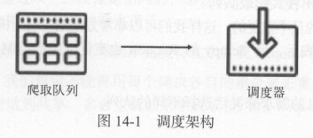
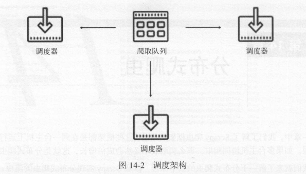
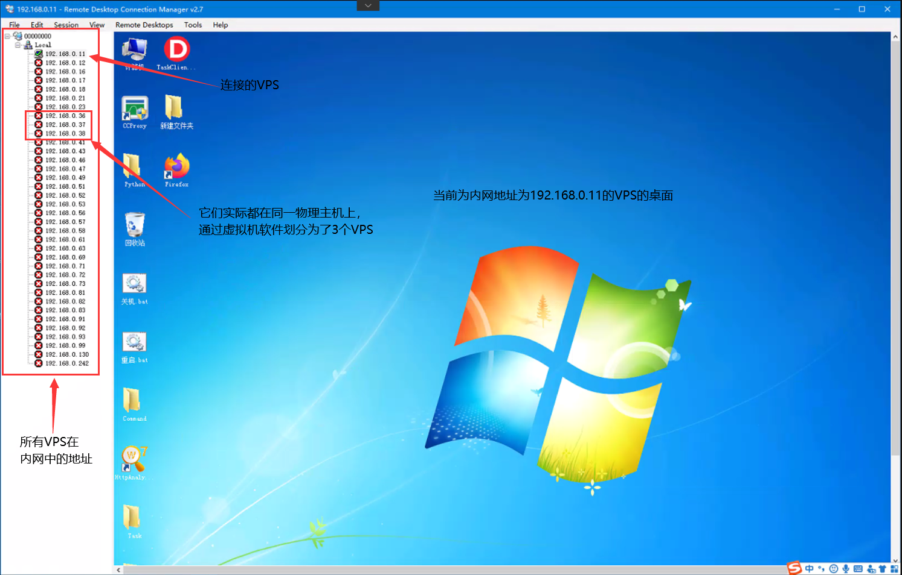
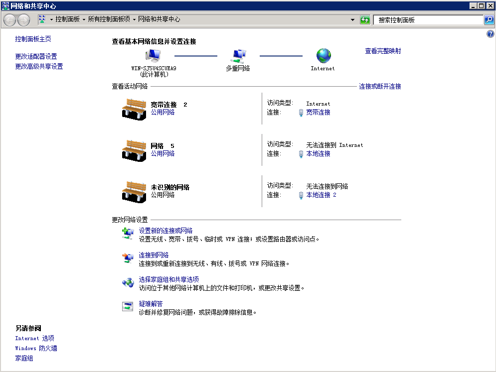

# 分布式爬虫

前面提到过，一个爬虫只运行在一个主机上，就算效率再怎么高，面对需要采集量巨大的任务时，仍然会显得力不从心。**假如，我们将爬虫分布到多台主机上，再共享一个消息队列，那么采集效率就会翻倍，这就是“分布式爬虫”。**

### 技术原理

##### 分布式爬虫原理

Scrapy框架中，每个爬虫都有一个自己的request队列（消息队列）和一个自己的调度器，当爬虫启动以后，调度器从消息队列中获取request给爬虫进行爬取。



如果两个调度器同时从消息队列里面取 Request ，在带宽足够、正常爬取且不考虑队列存取压力的情况下，那么其爬取效率会翻倍。这样，调度器可以扩展多个，下载器也可以扩展多个，**而爬取队列 Queue 必须始终为1个，也就是所谓的共享爬取队列。这样才能保证调度器从队列里调度某个 Request 后，其他调度器不会重复调度此 Request ，就可以做到多个调度器同步爬取。这就是分布式爬虫的基本雏形。**



我们需要做的就是在多台主机上同时运行爬虫任务协同爬取，而协同爬取的前提就是共享爬取队。**这样各台主机就不需要各自维护爬取队列，而是从共享爬取队列存取 Request。但是各台主机还是有各自的调度器和下载器，所以调度和下载功能分别完成。**如果不考虑队列存取性能消耗，爬取效率还是会成倍提高。

##### VPS技术

上面首先就提到了，分布式爬虫需要使用到多台主机，这里的主机并不是指硬件上的一台主机，也可以是虚拟主机，本着充分利用计算机资源的原则，VPS技术派上用场了。

VPS技术：**Virtual Private Server 虚拟专用服务器，将一台服务器分割成多个虚拟专享服务器的优质服务。在容器或虚拟机中，每个VPS都可选配独立公网IP地址、独立操作系统、实现不同VPS间磁盘空间、内存、CPU资源、进程和系统配置的隔离，为用户和应用程序模拟出“独占”使用计算资源的体验。VPS可以像独立服务器一样，重装操作系统，安装程序，单独重启服务器。**

**简单理解，VPS就是通过虚拟化技术隔离出来的系统。**



上面的VPS都是通过**VMWare虚拟机软件**将物理主机的资源划分出来的，在一台物理主机上面装了3个虚拟机。



在一台物理主机上面有多张网卡，每台虚拟主机可配置一张有线网卡进行单独拨号，因此每台虚拟主机的外网地址是不一样的。例如：

```
第一台虚拟主机的内网地址为192.168.0.11，外网地址为101.204.79.xxx
第二台虚拟主机的内网地址为192.168.0.12，外网地址为101.204.121.xx
```

##### 远程桌面连接

有了服务器我们还需要软件来连接这些服务器，使用的软件在上图中已有所展示，这里就不再展示了。

软件的名称：Remote Desktop Connection Manager(远程桌面管理工具)。

下载地址：[Remote Desktop Connection Manager](https://remotedesktopmanager.com/)

Remote Desktop Connection Manager能够集中管理多个远程桌面连接，并可在多个同时打开的远程面桌面间快速切换。而且即使我们重装了系统或在其他PC上也能快速载入这些常用的远程桌面。这对于管理需要定期访问每台机器（例如自动检入系统和数据中心）的服务器实验室非常有用。服务器被组织为命名组。您可以使用单个命令连接或断开连接到一个组中的所有服务器。您可以按一组缩略图查看组中的所有服务器，并在每个会话中显示实时操作。服务器可以从父组或凭据存储继承其登录设置。因此，当您更改实验室帐户密码时，只需在一个位置更改RDCMan存储的密码。通过使用（本地）登录的用户权限或X509证书使用CryptProtectData进行加密，可以安全地存储密码。