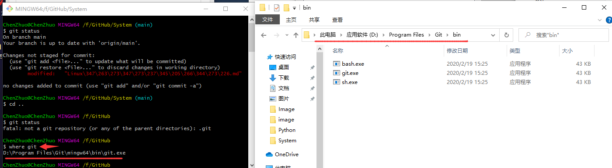

# Git提交操作

## 个人需求

对于我本人来说，因为长期维护多个项目的文档更新，每次提交更新时都会操作Git进入到每一个项目文件夹中执行相同的Git命令，显得十分繁琐且效率底低下，就像下面这样：


为此我们完全可以开发一个自动更新的项目内容并提交更新的Python脚本。

?> 至于什么是Git，参看《Document》中的《Git版本控制》。

## GitPython

### GitPython简介

GitPython是一个与Git库交互的Python库，包括底层命令（Plumbing）与高层命令（Porcelain）。它可以实现绝大部分的Git读写操作，避免了频繁与Shell交互的畸形代码。它并非是一个纯粹的Python实现，而是有一部分依赖于直接执行`git`命令，另一部分依赖于GitDB。

GitDB也是一个Python库。它为`.git/objects`建立了一个[数据库](https://cloud.tencent.com/solution/database?from=10680)模型，可以实现直接的读写。由于采用流式（stream）读写，所以运行高效、内存占用低。

### GitPython安装

执行下面命令安装GitPython：

```
pip install GitPython
```

其依赖GitDB会自动安装，不过可执行的`git`命令需要额外安装。

### 设置环境变量

**第三方库安装好了以后，就需要添加环境变量，否则第三方库会因找不到Git执行文件而报错。**

1.在git当中输入 `where git` 查找到git执行文件的位置或者直接找到git的安装路径：



2.将路径复制并粘贴到系统环境变量中的Path当中（注意：路径不要带有 `git.exe`）:


### 常见使用

安装的三方库名称GitPython，但导入的名称是git：

```python
import git

# 获取版本库对象（即项目文件夹中的.git文件夹）
repo = git.Repo(r'绝对路径\.git')
```

克隆 `clone` 分两种：

```python
# 一是从当前库clone到另一个位置
new_repo = repo.clone(path='../new')

# 二是从某个URL那里clone到本地某个位置：
new_repo = git.Repo.clone_from(url='git@github.com:USER/REPO.git', to_path='../new')
```

进行分支管理：

```python
# 新建分支
repo.create_head('new_branch')

# 查看当前分支
repo.active_branch
```

GitPython并未实现原版 `git status`，只给出了部分信息：

```python
# 当前工作区是否干净，如果有修改返回True，反之返回False
repo.is_dirty()
```

一般我们在工作目录做了改变之后，就会调用 `git add` 命令添加文件到暂存区，然后调用 `git commit` 命令提交更改，`Repo` 虽然没有添加、提交方法，但取而代之提供了一个 `git.cmd.Git` 对象实现对 Git 命令的调用，
通过 `Repo.git` 来进行 Git 命令操作。

```python
# git操作对象
git = repo.git
# 查看提交状态
print(git.status())
# 提交当前项目中所有改动到暂存区，相当于git add .
git.add('.')

# 获取版本库暂存区
index = repo.index
# 将改动内容从暂存区提交到历史区，类似于git commit -m 'update'
index.commit('update')

# 获取远程仓库
remote = repo.remote()
# 推送本地修改到远程仓库
remote.push()
```

## 功能代码

结合以上需求和第三方库的学习，我们就可以写一个自动更新并提交的Python脚本：

```python
```


